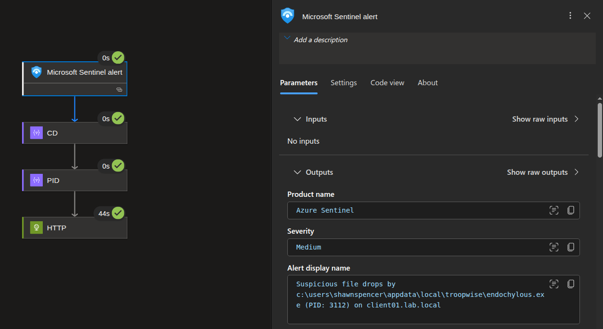
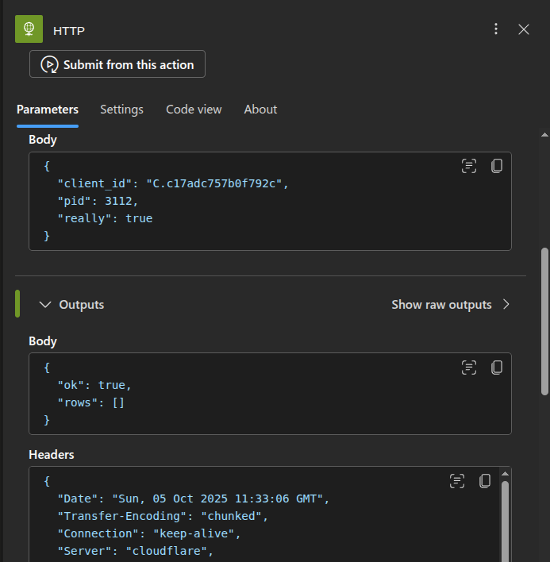
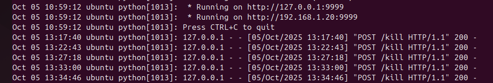
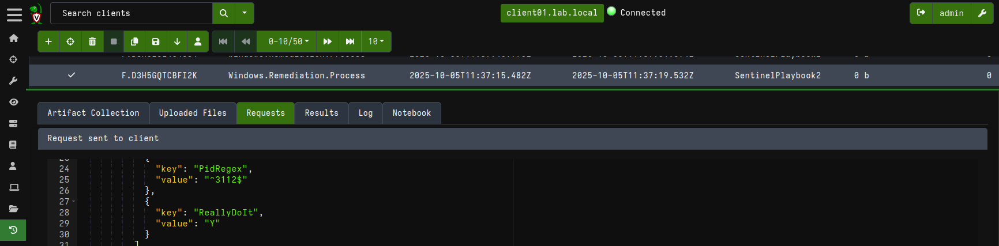
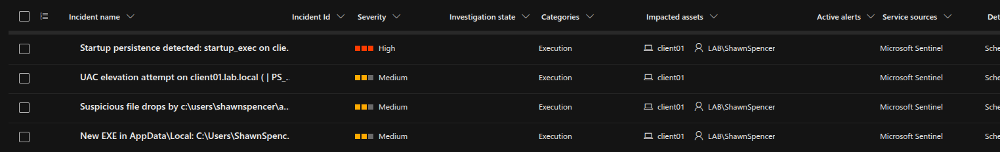
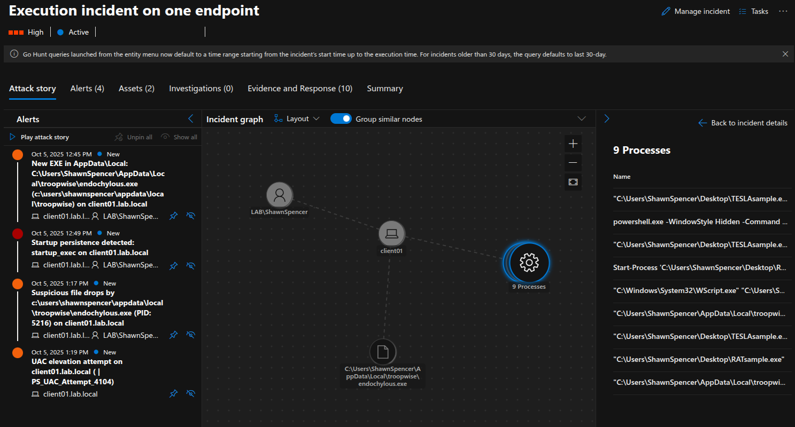

# Sentinel <=> Velociraptor Lab Report
**Author:** Nikola Marković  
**Status:** MVP (ongoing)  
**Last updated:** 2025-10-05  
**Repo:** https://github.com/Oligo12/cybersecurity-projects/
                                                                      
## 1) Executive Summary

Implemented Microsoft Sentinel playbook -> secure webhook -> Velociraptor API to terminate a target PID on alert. Demonstrates EDR-like remote response. Memory capture and file collection are planned.

## 2) Objectives & Scope

- Malware samples covered: **Agent Tesla**, **QuasarRAT**.
- Demonstrate: KQL detections, incident -> playbook trigger, Velociraptor action, and evidence.
- Purpose: Hands-on learning of Sentinel detections, Logic Apps, and Velociraptor response (training PoC, not a production design).
- Non-goals: Full Malware Analysis (linked separately in per-sample reports).

## 3) Lab Topology (High‑Level)

- **VMs:** Windows detonation client(s), AD DC/DNS, Ubuntu (Velociraptor server + webhook), pfSense; optional analyst VM.
- **Cloud:** Azure Arc + AMA -> Log Analytics Workspace -> Microsoft Sentinel.
- **Ingress:** Cloudflare Tunnel -> `https://webhook.[domain]/` -> Flask webhook -> Velociraptor API.

### **Diagram:**                                                                                                                                                            
                                                                                                                   
_*Signal flow: AMA -> LAW (443) via pfSense; Sentinel -> Cloudflare Tunnel -> ubuntu:9999 (Flask webhook); Velociraptor gRPC on 8001; UI 8889 (internal).*_                                                                                         

**Key IPs/Ports:**

- Velociraptor UI/API: **:8889 / :8001**
- Webhook: **:9999** (behind Cloudflare)
- Detonation VM: **192.168.1.101**
- Velociraptor Server: **192.168.1.20**
- Client ID (lab): **C.c17adc757b0f792c**

## 4) Data Flow

1. Sysmon/Windows Events -> AMA -> LAW.
2. Sentinel analytic rule fires.
3. Logic App playbook -> HTTPS POST to webhook (`/kill`). (Planned: `/memdump`, `/collect`)
4. Webhook validates token -> calls **Velociraptor** (VQL artifact) against **client_id**.
5. Artifact completes -> results downloaded / host contained / process killed.

## 5) Detections (overview)

- **Startup-folder persistence (drop OR execute):** Detects script/shortcut drops into the per-user Startup folder and interpreters launching items from Startup.
- **Suspicious AppData\Local EXE creation:** Flags new .exe written under AppData\Local\<folder>, emphasizing first-seen parent folders with basic allowlists.
- **User-writable parent -> drop to Temp/AppData:** Correlates a child process spawned by a user-writable parent with file writes to Temp/AppData/Desktop within a short window.
- **UAC elevation via script hosts:** Detects -Verb RunAs and similar elevation attempts by PowerShell/script hosts; optionally correlates to Event 4672.

[Full KQL here](#a-kql-rules-full)


## 6) Automation (SOAR)

**Playbook:** PB-KillProcess

- **Trigger:** Alert
- **Action:** HTTP -> `https://webhook.[domain]/kill`
- **Body example:**

```json
{ "client_id": "C.c17adc757b0f792c", "pid": 1234, "really": true }
```

- **Run history:**

 
_*Run succeeded; alert details confirm PID 3112 on client01.*_                                                                                                                                                  
                                                                                                                                                                                                          
                                                                                                                  
_*HTTP posted to `/kill` -> 200 OK; `{ok:true}` returned.*_
 
**Webhook (Flask) essentials**

- Validates `X-Auth-Token`, basic input checks.
- Calls Velociraptor server API with local config.
- Returns JSON status to Sentinel.

                                                                                                                                                                                                                              
_*Flask webhook received `POST /kill` from the playbook and returned **200** (timestamps shown). `127.0.0.1` appears because the tunnel/proxy forwards to the local Flask service on `:9999`.*_

**Velociraptor artifacts (VQL)**

- **Used:** `Windows.Remediation.Process` (terminate by PID/name)
- **Planned:** `Generic.System.Pstree`, `Windows.Memory.ProcessDump`, `Windows.Remediation.Quarantine`

## 7) Per-Sample Walkthroughs

### 7.1 Agent Tesla (AutoIt loader -> RegSvcs host)

- **Signal:** User-writable parent spawns -> file creates under AppData/Temp/Desktop shortly after.
- **Alert -> Playbook:** PB-KillProcess executed against detected PID.
- **Velociraptor action:** Kill PID (memdump/collection planned).
- **Evidence (Screens):**
                                                                                          
                                                                                                                                                                  
_*Artifact `Windows.Remediation.Process` dispatched to `client01.lab.local`; params `PidRegex="3112$"`, `ReallyDoIt="Y"`.*_                                                                                       
                                                                                                                    
                                                                                
_*All four detections fired on `client01.lab.local` (Startup persistence, UAC attempt, suspicious file drops, new EXE in AppData\Local).*_                                                                                               
                                                                                         
                                                                                                                                                                   
_*Graph links user `LAB\ShawnSpencer`, host `client01`, parent `TESLAsample.exe`, and dropped `AppData\Local\troopwise\endochylous.exe`. Right panel shows 9 related processes.*_

### 7.2 QuasarRAT (.NET launcher)

- **Signal:** Suspicious script host / network behavior indicative of RAT staging.
- **Alert -> Playbook:** <<placeholder, future work>>
- **Velociraptor action:** <<placeholder, future work>>
- **Evidence (Screens):** <<placeholder, future work>>

## 8) Current Status (2025-10-05)

- Implemented: **/kill** (remote process termination) 
- Verified: **200 OK** from playbook + Velociraptor artifact completion 
- Planned next: **/memdump**, **/collect** (playbooks & artifacts) 

## 9) Security & Hardening (current)
- Webhook protected by `X-Auth-Token` behind Cloudflare Tunnel (no rate limiting yet; static token).
- Velociraptor API/UI internal-only; service runs as non-root (`velociraptor`); default TLS certs in place.
- Cloudflare tunnel bound to hostname; no Zero Trust/WAF policy or DNS egress restrictions in this MVP.

### 9.1 Required hardening steps
- Add rate limiting (Cloudflare WAF rule or Flask-Limiter) and rotate the webhook token.
- Apply Cloudflare Zero Trust policy to the webhook route; restrict DNS egress via pfSense.

## 10) Limitations
- **Latency:** Scheduled analytics at 5 min; playbook HTTP ~44 s -> end-to-end ≈ 1–6 min (lab), not real-time.
- **Scope:** Single endpoint; manual `client_id` mapping; no host isolation or memory/file collection yet.
- **Ops:** Webhook/tunnel add extra hops; limited monitoring/retries; lab-grade hardening.

## 11) Future Work
- Implement `/memdump` and `/collect` playbooks; parse results back into Sentinel.
- Add Suricata/Zeek; enrich KQL with signer/reputation; tune rules/suppression.
- Add host-isolation artifact.
- Ingest webhook & Velociraptor logs to Sentinel; alert on failures.
- Expand to multiple endpoints; automate `client_id` mapping.

## 12) Appendices

### **A. KQL rules (full)**

#### Startup-folder persistence (drop OR execute):
```kusto
// Rule: Startup-folder persistence (drop OR execute)
// Why: Attackers often drop script/shortcut payloads into Startup and/or launch them via script interpreters.
// Lab note: Minimal trims below to keep signal visible.
// Prod note: Add allow/suppress lists for known mgmt scripts, software updaters, signed vendor tools, and EDR/VT/TI correlation.

// DROP signal: suspicious file created in the per-user Startup folder (scripts/shortcuts only)
let s_drop =
    Sysmon_11_FileCreate()
    | where isnotempty(target_filename)
    | extend target_lc = tolower(target_filename), ext = tolower(file_ext)
    | where target_lc has @"\microsoft\windows\start menu\programs\startup\"
    // Focus on scriptable/autostart-friendly types, avoiding noisy .exe/.msi (currently no integrity check telemetry in this lab)
    | where ext in ("vbs","vbe","js","jse","wsf","wsh","hta","ps1","bat","cmd","lnk","scr")
    | extend detection = "startup_drop"
    | extend b_user_name = user_name
    | project time_generated, computer, b_user_name, detection,
              process_id, process_path, target_filename, file_ext;

// EXEC signal: interpreters launching scripts or items from Startup
let s_exec =
    Sysmon_1_ProcessCreate()
    | extend proc_lc = tolower(process_path), cmd_lc = tolower(tostring(command_line))
    // Common script/host interpreters
    | where proc_lc matches regex @"\\(w|c)script\.exe$"
        or proc_lc matches regex @"\\powershell(?:\.exe)?$"
        or proc_lc matches regex @"\\cmd\.exe$"
        or proc_lc matches regex @"\\mshta\.exe$"
        or proc_lc matches regex @"\\rundll32\.exe$"
        or proc_lc matches regex @"\\javaw?\.exe$"
    // Evidence of script path or Startup path on the cmdline
    | where cmd_lc has_any (".vbs",".vbe",".ps1",".js",".jse",".wsf",".wsh",".hta",".bat",".cmd",".lnk",".scr")
        or cmd_lc has @"\microsoft\windows\start menu\programs\startup\"
    // Typical installer/updater noise (expand with signer/parent checks)
    | where not(cmd_lc contains "azcmagent" or cmd_lc contains "check_updates.ps1")
    | where tolower(parent_process_name) !in ("msiexec.exe","setup.exe","gc_arc_service.exe")
    // Known benign GoogleUpdater uninstall flow
    | where not( cmd_lc has @"\program files (x86)\google\googleupdater\" and cmd_lc has "uninstall.cmd" )
    | extend a_user_name = user_name
    | extend detection = "startup_exec"
    | project time_generated, computer, a_user_name, detection,
              process_id, process_path, command_line, parent_process_name;

// Fire if either signal appears
union s_drop, s_exec
| order by time_generated desc
| extend user_name = coalesce(a_user_name, b_user_name)
| project-away a_user_name, b_user_name
```

#### Suspicious AppData\Local EXE creation: 
```kusto
// Rule: Suspicious EXE creation under AppData\Local\<folder>
// Why: Attackers commonly drop or unpack payloads into user-writable AppData\Local subfolders.
// Lab note: Current allowlist is hardcoded to reduce noise (Microsoft, WindowsApps, etc.).
// Prod note: Replace static folder/process excludes with enrichment, such as signer verification, EDR telemetry, VT reputation, and injection context.

// FileCreate (Sysmon EID 11) - normalize fields
let fc = Sysmon_11_FileCreate()
| where isnotempty(target_filename)
| extend target_filename_s = tostring(target_filename)
| extend path = tolower(target_filename_s),
         pid_s = tostring(process_id);

// Candidate EXEs created under AppData\Local\<folder>
let exes = fc
| where path has @"\appdata\local\" and file_ext == "exe"
| extend parent_folder = extract(@"(.*\\appdata\\local\\[^\\]+)\\", 1, path)
| where isnotempty(parent_folder);

// First observed write in each parent folder (baseline)
let first_seen_parent = fc
| extend parent_folder = extract(@"(.*\\appdata\\local\\[^\\]+)\\", 1, path)
| where isnotempty(parent_folder)
| summarize first_seen = min(time_generated) by parent_folder;

// Allowlists (lab-only, replace with richer checks in production)
let allowed_parent_folders = dynamic([
  "\\appdata\\local\\microsoft\\",
  "\\appdata\\local\\packages\\",
  "\\appdata\\local\\windowsapps\\",
  "\\appdata\\local\\package cache\\",
  "\\appdata\\local\\packagecache\\",
  "\\appdata\\local\\discord"
]);
let allowed_creators = dynamic([
  "sysmon.exe","onedrive.exe","onedrivesetup.exe","msiexec.exe","setup.exe","installer.exe"
]);

// Base detection: suspicious EXEs in new parent folders within 10m
let base = exes
| join kind=inner (first_seen_parent) on parent_folder
| where time_generated - first_seen <= 10m
| where not(tolower(parent_folder) has_any (allowed_parent_folders))
| where tolower(process_name) !in (allowed_creators)
| project time_generated, computer, user_name, parent_folder,
          target_filename_s, process_name, process_path, pid_s;

// ProcessCreate (Sysmon EID 1) for enrichment
let pc = Sysmon_1_ProcessCreate()
| extend pid_s = tostring(process_id)
| project pc_time = time_generated, computer, pid_s,
          command_line, parent_process_name, parent_process_path;

// Enrich Rule hits with nearest ProcessCreate for same PID (within 10m)
base
| join kind=leftouter (pc) on computer, pid_s
| extend time_diff_s = abs(datetime_diff('second', time_generated, pc_time))
| where isnull(time_diff_s) or time_diff_s <= 600
| summarize arg_min(time_diff_s, *) by time_generated, computer, pid_s, target_filename_s
| project time_generated, computer, user_name,
          parent_folder, target_filename = target_filename_s,
          process_name, process_path, process_id = pid_s,
          command_line, parent_process_name, parent_process_path, time_diff_s
| order by time_generated desc
```

#### User-writable parent -> drop to Temp/AppData:
```kusto
// Rule: Child process (spawned by a user-writable parent) writes to AppData/Temp soon after start.
// Why: Malware often launches from user-writable dirs and quickly drops/unwraps payloads nearby.
// Lab note: Allowlist below suppresses known benign parents (Discord/OneDrive/Defender).
// Prod note: Replace static allowlist with signer/EDR/TI enrichment (publisher, reputation, path controls).

let window = 3m;

// Candidate set: child processes whose parent image path is user-writable (not \Windows\*)
let parents =
    Sysmon_1_ProcessCreate()
    | extend parent_path = tolower(parent_process_path),
             process_path = tolower(process_path)
    | where isnotempty(parent_path)
    | where parent_path has_any(@"\users\", @"\appdata\", @"\programdata\", @"\local\temp\")
    | where parent_path !has @"\windows\"
    // Tuning: exclude WerFault (crash handler) noise from parent context
    | where parent_process_name != "werfault.exe"
    // Lab-only allowlist to cut noise (replace with EDR/AV + TI correlation in prod)
    | where parent_path !in (
        @"c:\users\shawnspencer\appdata\local\microsoft\onedrive\update\onedrivesetup.exe",
        @"c:\users\shawnspencer\appdata\local\discord\update.exe",
        @"c:\programdata\microsoft\windows defender\platform\4.18.25080.5-0\msmpeng.exe",
        @"c:\users\shawnspencer\appdata\local\microsoft\onedrive\onedrivestandaloneupdater.exe"
      )
      | extend user_name = tostring(column_ifexists("user_name",""))
    | project p_time = time_generated, computer, process_id, process_path, command_line,
              parent_process_id, parent_process_path = parent_path, parent_process_name, parent_command_line, user_name;

// Drops: file creates into Temp/AppData/Desktop within `window` of the child's start time (p_time)
let drops =
    Sysmon_11_FileCreate()
    | extend tgt = tolower(target_filename)
    | where tgt has_any(@"\appdata\local\", @"\appdata\roaming\", @"\local\temp\", @"\temp\", @"\desktop\")
    | where tgt !has @"\appdata\local\google\chrome\user data\default\cache\"
      and tgt !has @"\appdata\local\microsoft\edge\user data\default\cache\"
      and not(tgt matches regex @"\\~\$.+\.(docx|xlsx|pptx)$")
    // Fill extension if Sysmon didn't populate file_ext (derive from path)
    | extend file_ext = iff(isempty(file_ext), tostring(extract(@"\.([a-z0-9]{1,8})$", 1, tgt)), file_ext)
    | project file_time = time_generated, computer,
              drop_process_id = process_id,
              target_filename = tgt, file_ext;

// Join EID 1 (process start) <-> EID 11 (file create) for the same child PID
parents
| join kind=inner (drops) on computer
| where drop_process_id == process_id
| where file_time between (p_time .. p_time + window)
| summarize
    first_seen   = min(file_time),
    last_seen    = max(file_time),
    drop_events  = count(),
    sample_targets = make_set(target_filename, 15),
    sample_exts    = make_set(file_ext, 10),
    arg_max(file_time, process_id, parent_process_id, command_line, parent_command_line, process_path, parent_process_path)
  by bin(file_time, 10m),
     computer,
     tostring(process_path),
     tostring(parent_process_path),
     tostring(parent_process_name),
     tostring(user_name)
| project time_generated = first_seen, last_seen, drop_events,
         computer,
         user_name            = tostring(user_name),
         parent_process_name  = tostring(parent_process_name),
         parent_process_path  = tostring(parent_process_path),
         parent_process_id,
         process_path         = tostring(process_path),
         process_id,
         command_line, parent_command_line,
         sample_exts, sample_targets
| order by last_seen desc
```

#### UAC elevation via script hosts:
```kusto
// Rule: UAC elevation attempts via PowerShell / script hosts
// Why: Attackers trigger UAC via "-Verb RunAs" or script hosts; privileged token (4672) often follows.
// Lab note: Regex-based suppressions below only to cut lab noise (Azure agent etc.).
// Prod note: Replace regex with publisher/signature checks, AMSI/EDR + VT/TI, and curated allow/suppress lists.

let elevationWindow = 1m;
let script_hosts = dynamic(["powershell.exe","pwsh.exe","cmd.exe","wscript.exe","cscript.exe","mshta.exe"]);

// Lab-only suppressions. In prod: use signer/reputation instead of regex-only.
let benign_cmd_patterns = dynamic([
  "\\\\Program Files\\\\AzureConnectedMachineAgent\\\\",
  "AzureMonitorAgentExtension\\.exe",
  "Microsoft\\.Azure\\.Monitor\\.AzureMonitorWindowsAgent",
  "azcmagent_check_updates\\.ps1",
  "SCHTASKS\\.EXE.*\\sazcmagent\\b",
  "Heartbeat\\.psm1",
  "Test-ChangeTrackingEnabled",
  "C:\\\\ProgramData\\\\GuestConfig\\\\downloads\\\\AzureWindowsBaseline\\\\pre_install\\.ps1",
  // Encoded: [Environment]::OSVersion.Version
  "-encodedCommand\\s+IABbAEUAbgB2AGkAcgBvAG4AbQBlAG4AdABdADoAOgBPAFMAVgBlAHIAcwBpAG8AbgAuAFYAZQByAHMAaQBvAG4AIAA=",
  "HKCU:\\\\Software\\\\Classes\\\\Local Settings\\\\Software\\\\Microsoft\\\\Windows\\\\Shell\\\\BagMRU",
  "HKCU:\\\\Software\\\\Classes\\\\Local Settings\\\\Software\\\\Microsoft\\\\Windows\\\\Shell\\\\Bags",
  "GroupView"
]);
let benign_parent_patterns = dynamic([
  "\\\\Program Files\\\\AzureConnectedMachineAgent\\\\",
  "AzureMonitorAgentExtension\\.exe",
  "Microsoft\\.Azure\\.Monitor\\.AzureMonitorWindowsAgent"
]);

let is_benign = (txt:string) { tolower(txt) matches regex strcat(@"(", strcat_array(benign_cmd_patterns, "|"), @")") };
let benign_parent = (pp:string) { tolower(pp) matches regex strcat(@"(", strcat_array(benign_parent_patterns, "|"), @")") };

// A1 - PowerShell ScriptBlock (4104) with explicit RunAs (content signal)
let A1_PS_RunAs_4104 =
    win_4104_powershell_scriptblock
    | where isnotempty(script_block_text)  
    | where tolower(script_block_text) contains "-verb runas"
    | where not(is_benign(script_block_text))
    | extend det_rule = "PS_UAC_Attempt_4104",
             user_coalesced = tostring(column_ifexists("user_name","")),
             evidence_coalesced = tostring(script_block_text);

// A2 — Sysmon EID 1: script host using RunAs semantics (process signal)
let A2_PS_RunAs_Sysmon =
    Sysmon_1_ProcessCreate()
    | extend proc_lc = tolower(process_name), cl = tolower(tostring(command_line))
    | where proc_lc in (script_hosts)
    | where cl has "-verb runas"
       or (cl has "start-process" and cl has "-verb" and cl has "runas")
    | where not(is_benign(cl)) and not(benign_parent(parent_process_path))
    | extend det_rule = "PS_UAC_Attempt_Sysmon1",
             user_coalesced = tostring(column_ifexists("user_name","")),
             evidence_coalesced = tostring(column_ifexists("command_line",""));

// B - Correlation: script host (EID 1) → 4672 (special privs) within elevationWindow
// Requires (SeDebug OR SeTcb) to reduce generic 4672 noise.
let B_ScriptHost_then_4672_base =
    Sysmon_1_ProcessCreate()
    | where tolower(process_name) in (script_hosts)
    | where not(is_benign(command_line)) and not(benign_parent(parent_process_path))
    | extend sh_time = time_generated,
             sh_user = tostring(column_ifexists("user_name","")),
             sh_proc = process_name,
             sh_cmd  = command_line;

let B_ScriptHost_then_4672 =
    B_ScriptHost_then_4672_base
    | join kind=inner (
        win_4672_special_privs
        | where has_sedebug or has_setcb
        | extend elev_time = time_generated, elev_user = subject_user_name
        | project-away time_generated
    ) on computer
    | where elev_time between (sh_time .. sh_time + elevationWindow)
      and (isempty(sh_user) or isempty(elev_user) or tolower(sh_user) == tolower(elev_user))
    | extend time_generated = sh_time,
             det_rule = "ScriptHost_then_4672",
             user_coalesced = tostring(column_ifexists("elev_user", sh_user)),
             evidence_coalesced = strcat(tostring(sh_proc),
                                         " -> 4672 within ",
                                         tostring(elevationWindow),
                                         " | cmd=", tostring(sh_cmd));

// Final Union Signals
A1_PS_RunAs_4104
| union A2_PS_RunAs_Sysmon
| union B_ScriptHost_then_4672
| where isempty(user_coalesced) or tolower(user_coalesced) !in ("system","administrator")
| project-reorder time_generated, computer, det_rule, user_coalesced, evidence_coalesced
| sort by time_generated desc
```

### **B. Playbook JSON (export)**
```
{
    "id": "TestPlaybook",
    "title": "TestPlaybook",
    "description": "TestPlaybook",
    "iconType": "Event",
    "skuType": "Consumption",
    "data": {
        "definition": {
            "$schema": "https://schema.management.azure.com/providers/Microsoft.Logic/schemas/2016-06-01/workflowdefinition.json#",
            "contentVersion": "1.0.0.0",
            "parameters": {
                "$connections": {
                    "defaultValue": {},
                    "type": "Object"
                }
            },
            "triggers": {
                "Microsoft_Sentinel_alert": {
                    "type": "ApiConnectionWebhook",
                    "inputs": {
                        "host": {
                            "connection": {
                                "name": "@parameters('$connections')['azuresentinel-1']['connectionId']"
                            }
                        },
                        "body": {
                            "callback_url": "@{listCallbackUrl()}"
                        },
                        "path": "/subscribe"
                    },
                    "description": ""
                }
            },
            "actions": {
                "HTTP": {
                    "runAfter": {
                        "PID": [
                            "Succeeded"
                        ]
                    },
                    "type": "Http",
                    "inputs": {
                        "uri": "https://[domain]/kill",
                        "method": "POST",
                        "headers": {
                            "X-Auth-Token": "[token]",
                            "Content-Type": "application/json"
                        },
                        "body": {
                            "client_id": "C.c17adc757b0f792c",
                            "pid": "@int(outputs('PID'))",
                            "really": true
                        }
                    },
                    "runtimeConfiguration": {
                        "contentTransfer": {
                            "transferMode": "Chunked"
                        }
                    }
                },
                "CD": {
                    "runAfter": {},
                    "type": "Compose",
                    "inputs": "@json(\n  if(\n    equals(triggerBody()?['ExtendedProperties']?['Custom Details'], null),\n    '{}',\n    triggerBody()?['ExtendedProperties']?['Custom Details']\n  )\n)\n"
                },
                "PID": {
                    "runAfter": {
                        "CD": [
                            "Succeeded"
                        ]
                    },
                    "type": "Compose",
                    "inputs": "@{string(first(json(string(outputs('CD')))?['process_id']))\n}\n"
                }
            },
            "outputs": {}
        },
        "parameters": {},
        "connections": {
            "azuresentinel-1": {
                "id": "/subscriptions[]",
                "connectionId": "",
                "connectionName": ""
            }
        }
    }
}
```

---
