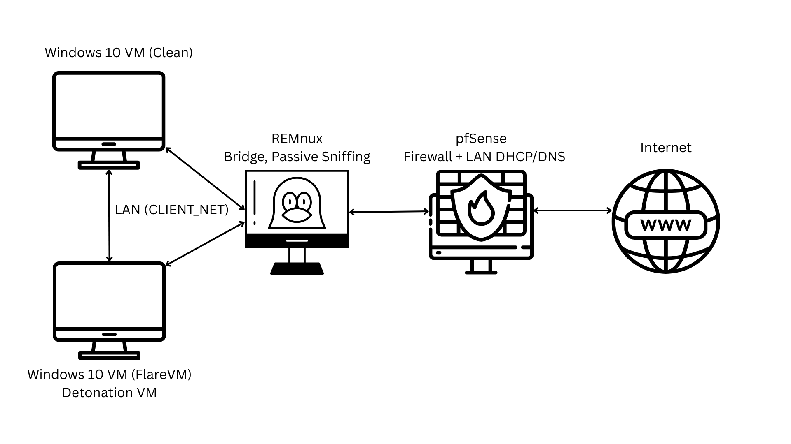

# QuasarRAT Malware Analysis Report
**Author:** Nikola Marković  
**Date:** 2025-09-05                                                                                       
**Version:** v1.0

_Disclaimer: This report is for educational and defensive security purposes only.  
All analysis was conducted in a controlled lab environment.  
No live malware samples are shared. Network indicators and artifacts are published solely to aid detection and threat hunting._  

---

## Table of Contents

1. [Executive Summary](#1-executive-summary)  
2. [Scope & Methodology](#2-scope--methodology)  
3. [Environment](#3-environment)  
4. [Sample Metadata](#4-sample-metadata)                                                                                                                            
    - [4.1 Initial Payload](#41-initial-payload)                                                                                        
    - [4.2 Dropped Launcher](#42-dropped-launcher)
5. [Static Analysis](#5-static-analysis)                                                                                                                                       
    - [5.1 Initial Payload](#51-initial-payload)                                                                       
    - [5.2 Dropped Launcher](#52-dropped-launcher)                                        
6. [Config Decryption Findings](#6-config-decryption-findings)
7. [Pinned Certificate & Signature Verification](#7-pinned-certificate--signature-verification)
8. [Summary of Observed Behavior](#8-summary-of-observed-behavior)
9. [Persistence](#9-persistence)
10. [Network Activity](#10-network-activity)
11. [MITRE ATT&CK Mapping](#11-mitre-attck-mapping)
12. [Indicators of Compromise (IOCs)](#12-indicators-of-compromise-iocs)
13. [Limitations & Future Work](#13-limitations--future-work)
14. [Conclusion](#14-conclusion)
15. [Appendices](#15-appendices)
    - [Appendix A - Execution Timeline](#appendix-a---execution-timeline)
    - [Appendix B - Decryption Walkthrough & Scripts](#appendix-b--decryption-walkthrough--scripts)
    - [Appendix C - Full Config Map](#appendix-c--full-config-map)
    - [Appendix D - Certificate Dump & Signature Verification Transcript](#appendix-d--certificate-dump--signature-verification-transcript)
    - [Appendix E - Screenshots](#appendix-e---screenshots)
    - [Appendix F - Extra Code Paths](#appendix-f---extra-code-paths)

---

## 1. Executive Summary

This report analyzes a QuasarRAT sample consisting of a native C++ dropper that deploys a .NET-based launcher.                                                                                                         
The launcher decrypts its embedded configuration, verifies a pinned certificate, and prepares C2 connectivity via HTTPS to Pastebin-hosted endpoints.

Dynamic execution in a controlled lab showed the malware attempting to escalate privileges immediately. If executed without administrator rights, the initial payload spawns a PowerShell process to prompt the user for elevation. If declined, the program terminates. If accepted, the malware re-runs itself with high integrity, drops the secondary launcher, and continues execution.                                                           

Key capabilities identified include:

- AES-encrypted configuration with hardcoded key.
- Certificate pinning and RSA signature verification for C2 trust.
- Registry Run-key persistence.
- Network bootstrap via HTTPS to Pastebin, followed by repeated beacon attempts to a direct C2 server (TCP/4444).
- No worming or lateral movement within the internal network was observed during analysis.
- Dormant features (file management, remote desktop, keylogging) observed statically but not triggered.
                                                                                         
This QuasarRAT variant demonstrates common commodity RAT tradecraft, such as strong configuration obfuscation, persistence via registry keys, and reliance on third-party infrastructure for C2 bootstrap. Crucially, it requires elevated privileges for its primary execution path, either being detonated by an administrator or accepted through the UAC prompt.

---

## 2. Scope & Methodology

**Purpose:** 

- Document observable behavior of the QuasarRAT sample from detonation to persistence.
- Capture the privilege escalation requirement and full process chain leading to the dropped .NET launcher.
- Extract and decrypt embedded configuration values.
- Verify the certificate pinning and signature check mechanisms.
- Map observed and inferred techniques to the MITRE ATT&CK framework.

---
                                                                                                  
**Methodology:** 

- The sample was detonated in a controlled, multi-VM lab with staged firewall rules to prevent unintended outbound communication.
- Analysis was conducted in phases:
  - Static triage (hashes, metadata, entropy, imports, strings)
  - Dynamic runs under different privilege levels (user vs. administrator) to confirm escalation behavior and payload drop.
  - Light reverse engineering of the dropped .NET launcher with dnSpy to recover configuration and certificate logic.
  - Network capture & firewall logs review to identify DNS and outbound TLS attempts.
- Each detonation was performed from a clean snapshot, with artifacts and logs collected after execution.

---
                                                    
**Tools Used:** 

- **Static analysis:** Detect It Easy (DIE), PEStudio, FLOSS, capa, dnSpy
- **Dynamic analysis:** ProcMon, API Monitor, Regshot, TCPView, Wireshark, pfSense logs
- **Scripting:** Assisted scripting (PowerShell/Python/AI) for decryption

---

## 3. Environment

**Lab Setup**

- **Microsoft Windows 10 Enterprise Evaluation (Version 22H2, OS Build 19045, FlareVM)** – malware detonation VM, patched, Windows Defender Antivirus and Windows Firewall disabled.
- **Microsoft Windows 10 Enterprise Evaluation (Version 22H2, OS Build 19045, Clean)** – clean VM connected to the same network, Windows Defender Antivirus and Windows Firewall disabled.
- **pfSense Firewall VM** – mediates all outbound traffic, configurable rules (DNS/HTTP/S only, ICMP, LAN-to-LAN, or full block). WAN interface connected through NAT.
- **REMnux VM** – positioned as a transparent bridge (Layer 2 between CLIENT_NET and FW_NET) between malware VM and pfSense. Runs TShark to capture all packets; invisible to malware.

---

**Detonation VM OS and Patch Information**

- **OS:** Microsoft Windows 10 Enterprise Evaluation
- **Build:** 22H2 (OS Build 19045.2006)
- **Architecture:** x64
- **Status:** Fully patched, SMBv1 manually enabled
- **Installed Updates:** KB5017022, KB5015684, KB5015020, KB5015878, KB5017308, KB5016705

---

**VirtualBox Networking** 

  -  **CLIENT_NET** (Internal Network): Windows VMs ↔ REMnux.
  -  **FW_NET** (Internal Network): REMnux ↔ pfSense LAN.
  -   pfSense LAN subnet: 192.168.1.0/24, DHCP enabled.
  -   pfSense WAN NIC: NAT towards host.

---
 
**Connectivity Controls**
- **Stage1 (Safe):** Block all outbound internet. Allow only LAN-to-LAN, DNS, optional ICMP.  
- **Stage 2 (Restricted):** Stage 1 + HTTP/S (closely monitored).  
- No full "allow all" stage was used, to prevent risk of botnet participation or worm propagation.

 
*VMs are hosted in Oracle VirtualBox*

---

## 4. Sample Metadata

### 4.1 Initial Payload
#### Hereafter referred to as main_sample.exe

- **SHA256:** 3662a8d4f950c9ebd0851e0b0713f2e48dfb7dd5ac3de02bae8acd1d6c4efd1d
- **SHA1:** dbe89fdde3fe98a3db192156b8b24a4c516bbe3f
- **MD5:** 0638de0435b4ba809cd39f311ab002bf
- **Original File Name**: SecurityHealthService.exe
- **File Type:** Executable, 64-bit, GUI
- **Language:** C++
- **Compiler/Linker:** Microsoft Visual C/C++ (19.36.34435) [LTCG/C++]  
   - Detected by DIE: Microsoft Linker 14.36 (build 34435)  
   - Detected by PEStudio: Microsoft Linker 14.42  
- **Toolset:** Visual Studio(2022, v17.6)
- **Packer/Compression:** High entropy; `.data` section compressed/packed
- **Compile timestamp:** Wed Aug 27 19:01:14 2025 (UTC) 
- **File Size:** ~2.01 MB (1.92 MiB)
- **Entropy:** 7.969 bits/byte
- **Entry Point:** 0x40001de8 (.text section)
- **Manifest:** requestedExecutionLevel="asInvoker"

---

### 4.2 Dropped Launcher

- **SHA256:** 3d15aae7debe0e712727d20c8ab292d342927c8e3e745c828e989c256cd02f3b
- **SHA1:** 5b6cb8cb7f78f370a3d0d574473e790515a40b5a
- **MD5:** d555deb50f797c4c56da847c24e64e0b
- **Observed file name / path:** C:\Users\<user>\AppData\Local\Temp\(variant)####.exe                                                                                                                                          *(Observed variants include sys####.exe, win####.exe, upd####.exe, tmp####.exe, dat####.exe - randomized per execution)*
- **Original File Name**: Client.exe
- **File Type:** Executable, 32-bit, .NET (GUI)
- **Language / Framework:** C# — .NET Framework v4.7.2 (CLR v4.0.30319)
- **Compiler/Linker:** Microsoft Linker (MSVC toolchain for .NET)                                                                                                                                  
  *(exact sub-build not resolved; tools disagree as expected)*
- **Toolset:** Visual Studio
- **Packer/Compression:** High entropy; Section 0 “.text” compressed/packed
- **Compile timestamp:** Sun Jun 16 04:24:56 2051 (UTC) 
- **Protections:** Obfuscation (CLR constructor, bad namings, watermark); Anti-analysis (anti-debug, anti-dnSpy, anti-Sandboxie, anti-VM)
- **File Size:** ~1.88 MB (1.79 MiB)
- **Entropy:** 7.764 bits/byte
- **Entry Point:** 0x005ca39e
- **Manifest:** requestedExecutionLevel="asInvoker"
- **Static Imports:** mscoree.dll → _CorExeMain *(typical for .NET; most calls resolved at runtime)*
- **.NET Module / Manifest names:** Client.exe / MyApplication.app
- **Notable flagged APIs (from import flags):** Send, GetCurrentThread *(plus many obfuscated identifiers)*                                                      

***Note:** The compile timestamp appears inconsistent/unrealistic and may have been tampered with or auto-set by the build environment.*
  
---

## 5. Static Analysis

### 5.1 Initial Payload

**Section & Entropy Layout (PEStudio / DIE):**

| Section   | Entropy | Packed          |
|-----------|---------|-----------------|
| PE Header | 2.77    | No              |
| .text     | 6.50    | Likely packed   |
| .rdata    | 5.00    | No              |
| .data     | 7.99    | Packed          |
| .pdata    | 4.91    | No              |
| .reloc    | 4.93    | No              |

*Overall entropy of ~7.97 bits/byte suggests compression or packing. The `.data` section in particular is fully packed.*

---

**Imports & Exports:**

- **Imports:** Minimal set  `KERNEL32.dll`, `USER32.dll`, `ADVAPI32.dll`  
- **Exports:** `DllMain`, `ServiceMain572` (common in service DLLs or droppers masquerading as services)  
- Minimal imports are a classic **packer/unpacking stub** pattern, with most APIs resolved dynamically at runtime.

---

**Notable API Calls (flagged by PEStudio / FLOSS):**

- **Memory management & injection potential:** `VirtualAlloc`, `VirtualProtect`, `WriteFile`, `CreateProcessA`  
- **Process enumeration:** `CreateToolhelp32Snapshot`, `Process32First/Next`  
- **Anti-analysis:** `IsDebuggerPresent`, `CheckRemoteDebuggerPresent`  
- **File enumeration & persistence:** `FindFirstFileExW`, `FindNextFileW`, `RegSetValueExA`  
- **Environment/Token handling:** `OpenProcessToken`, `GetTokenInformation`, `GetEnvironmentStringsW`

---

**capa Findings:**

- **Persistence:** Run key creation (`HKCU\Software\Microsoft\Windows\CurrentVersion\Run`)  
- **Process manipulation:** Create process, terminate process, RWX memory allocation  
- **Anti-analysis:** Anti-debug (`CheckRemoteDebuggerPresent`), anti-VM checks (`VBoxService`, `VMware Tools`), delayed execution (`Sleep`), stack strings obfuscation  
- **Other behaviors:** File create/write, PE header parsing, XOR-encoded strings

---

**FLOSS Decoded Strings (highlights):**

- VM/sandbox detection: `SYSTEM\CurrentControlSet\Services\VBoxService`, `SOFTWARE\VMware, Inc.\VMware Tools`  
- Privilege escalation:  
  `powershell.exe -WindowStyle Hidden -Command "Start-Process '%s' -Verb RunAs"` (used for UAC prompt relaunch)  
- Persistence: `SOFTWARE\Microsoft\Windows\CurrentVersion\Run`  
- Masquerade name generator: `%s%s%d.exe`
- Example fake names (from strings): `WindowsUpdate416`, `SystemService516`, `SecurityUpdate281`, `OneDriveSetup906`, `EdgeUpdate272`                                                                       
                                                                                                                                                                                                                       
***Note:** These values appear to be used when creating persistence via `HKCU\Software\Microsoft\Windows\CurrentVersion\Run` keys.*

---

**Interpretation:**

The initial payload is a **packed native stub** responsible for:

- Detecting VM/sandbox environments  
- Elevating privileges via UAC prompt  
- Dropping and launching the secondary .NET launcher with randomized filenames  
- Establishing persistence through registry run keys                                                                                              

*Its minimal import table, heavy use of memory management APIs, and capa’s RWX memory allocation findings suggest it unpacks/decrypts its main logic or secondary component at runtime.*

---

### 5.2 Dropped Launcher

**Section & Entropy Layout (PEStudio / DIE):**

| Section   | Entropy | Packed          |
|-----------|---------|-----------------|
| PE Header | 2.77    | No              |
| .text     | 7.77    | Packed          |
| .rsrc     | 4.67    | No              |
| .reloc    | 0.10    | No              |

*Overall entropy indicates the `.text` section is heavily obfuscated/packed, while other sections are clean.*

---

**Imports & Manifest:**

- **Imports:** Limited to `mscoree.dll` → `_CorExeMain` (other API calls resolved at runtime).  
- **Manifest:** `requestedExecutionLevel="asInvoker"`  

---

**capa Findings:**  
- Classified as **Launcher**.  
- Detected capabilities include registry modification, process execution, and persistence mechanisms.  

---

**FLOSS / Strings Analysis (highlights):**

- **Persistence:**  
  - `schtasks /create /tn … /sc ONLOGON /tr … /rl HIGHEST /f` → scheduled task creation with elevated privileges.  
  - RunOnce registry keys.  

- **Masquerade / Naming:**  
  - Masquerade generator: `%s%s%d.exe` → fake names like `WindowsUpdate416`, `SystemService516`, `OneDriveSetup906`.
                                                                                                                                                                    
***Note:** These values appear to be used for persistence Run-key naming.*  

- **Clipboard Hijacking:**  
  - Regex patterns for Bitcoin/BCH wallets → clipboard replacement.  
  - `"Clipboard change was from server (within 2s), not sending back"` → confirms wallet hijacking.  

- **Browser Manipulation & Injection:**  
  - Targeted processes: `chrome.exe`, `msedge.exe`, `firefox.exe`, `opera.exe`, `brave.exe`.  
  - Strings like `"Created suspended chrome process"` / `"Applied patch to … in chrome process"` suggest in-memory patching of browsers to bypass sandbox or intercept data.  

- **Reconnaissance:**  
  - WMI queries: `Win32_BIOS`, `Win32_BaseBoard`, `Win32_Processor`, `Win32_ComputerSystem`, `Win32_VideoController`.  

- **Anti-Analysis / Anti-VM:**  
  - Sandbox checks: AnyRun, Triage, Cuckoo, Sandboxie, Comodo, Qihoo360.  
  - VM checks: VMware, VirtualBox, QEMU, KVM, Parallels.  
  - Debugger/tool blacklists: x32dbg, x64dbg, dnSpy, OllyDbg, Windbg, HyperDbg, Immunity Debugger, Cheat Engine.  
  - Termination strings:  
    - `[FATAL] Process terminating due to virtualization detection - Exiting...`  
    - `[FATAL] Process terminating due to injection detection - Exiting...`  
    - `[FATAL] Process terminating due to debugger detection - Exiting...`  

- **System Recon / Host Info:**  
  - Strings for OS version, CLR version, process name, user name, working set.  

- **Capabilities (from strings + modules):**  
  - Clipboard hijacking  
  - Browser password theft (Chromium autofill fields)  
  - Remote desktop (HVNC) and hidden desktop switching (`DESKTOP_JOURNALRECORD`, `CreateDesktop`)  
  - Keylogger (`Pulsar.Common.Messages.Monitoring.KeyLogger`)  
  - Registry manipulation (create/rename/delete keys & values)  
  - Reverse proxy & C2 tunneling (`Pulsar.Common.Messages.Administration.ReverseProxy`)  
  - Screen/mic capture via SharpDX + NAudio  

---

**Interpretation:**  
The dropped launcher is a **.NET Quasar/Pulsar variant** with heavy obfuscation and extensive modular capabilities. While capa categorized it simply as a “Launcher,” static analysis reveals a feature-rich RAT including:  

- Credential theft (browser scraping, registry access)  
- Clipboard hijacking for cryptocurrency theft  
- Keylogging and screen/microphone capture  
- Browser process injection and manipulation  
- Remote desktop / HVNC  
- Persistence via Run/RunOnce keys and scheduled tasks  
- Strong anti-analysis features (VM, sandbox, debugger detection; immediate self-termination)  

*These features were largely not triggered in the lab due to restricted networking, but static strings confirm their presence.*

---

*.NET assembly reviewed in dnSpy, revealed encrypted config blobs, certificate verification routines, and multiple unused code paths (see [**Sections 6**](#6-config-decryption-findings), [**Section 7**](#7-pinned-certificate--signature-verification), and [**Appendix F**](#appendix-f---extra-code-paths)).*

---

## 6. Config Decryption Findings

Static review of the dropped .NET launcher in dnSpy revealed multiple AES-encrypted configuration blobs.                                                                                                                                                               
Using the hardcoded key and salt found in `Pulsar.Common.Cryptography.Aes256`, these blobs were successfully decrypted.                                                                                                                                                       
Details of the decryption routine and Python script are provided in [**Appendix B**](#appendix-b--decryption-walkthrough--scripts); the full decrypted config map is in [**Appendix C**](#appendix-c--full-config-map).

### Summary of Decrypted Config Values

| Field / String     | Value (this build)                               | Notes / Usage Context |
|--------------------|--------------------------------------------------|-----------------------|
| BootstrapUrl       | `https://pastebin.com/raw/MvTF8VPm`              | Initial channel for host/IP retrieval |
| BuildID            | `f685bd99-d0bc-431a-acce-e3286e647a4f`           | Unique build/client identifier |
| Campaign           | `Artistry Publications`                          | Campaign tag; confirmed via ThreatFox |
| MutexName          | `Local\f685bd99-d0bc-431a-acce-e3286e647a4f`     | Derived from BuildID; ensures single instance |
| ExeExtension       | `.exe`                                           |                      |
| VersionString      | `1.7.1`                                          | RAT build version; sent in client identification payload | |
| EmptyString1/2/3       | Empty strings                        |               |
| RSASignature       | 684-byte blob                                    | Verified against AES key string; proves config authenticity |
| PinnedCertificate  | RSA-4096, CN=`wfbdn wctm`, SHA512RSA             | Used for TLS pinning & signature verification |

***Note 1:** Some config fields (EmptyString1, EmptyString2, EmptyString3) were decrypted and referenced in code, but their precise function was not determined in this analysis.*                                                                                                           
***Note 2:** For readability, strings have been renamed during dnSpy analysis. Original obfuscated names are listed in [**Appendix C**](#appendix-c--full-config-map).*

### Notable Crypto Findings

- **Blob layout:** `[HMAC(32)] [IV(16)] [AES-CBC ciphertext]`  
- **Integrity:** HMAC-SHA256 over (IV||ciphertext) validated against the first 32 bytes  
- **Key derivation:** PBKDF2(master string = `1E4390A97721D94910FDB7294D5473ED8971A6A8`, salt = 32-byte static, iterations = 50,000)  
- **Keys:** First 32 bytes = AES-256 key; next 64 bytes = HMAC-SHA256 key  
- **Padding:** AES-256-CBC with PKCS7

### Additional Observations (from config & code)

- **TLS setup:** Client establishes TLS 1.2 to the C2; validates server cert against pinned config blob (**prevents blue-team MITM**)
- **Protocol:** Fixed header + body (framed messages), with async read loop for continuous C2 comms.  
- **Keep-alive:** TCP keep-alive every 25s to maintain long-lived sessions.  
- **Driver path:** Config references `https://www.amyuni.com/downloads/usbmmidd_v2.zip` (USB virtual display driver).  
  - Artifacts: `usbmmidd_v2.zip`, `deviceinstaller64.exe`, `usbmmidd.inf`  
  - Purpose: install a virtual display adapter to support RDP/screen capture on headless hosts.  
  - Requires UAC/admin privileges.  

---

**References:**  

- Full config dump: [**Appendix C**](#appendix-c--full-config-map).
- Certificate dump & signature verification: [**Section 7**](#7-pinned-certificate--signature-verification) and [**Appendix D**](#appendix-d--certificate-dump--signature-verification-transcript).
- Decryption walkthrough & script: [**Appendix B**](#appendix-b--decryption-walkthrough--scripts).
- The AES key derivation routine is shown in [**Fig. E.5**](#fig-e5).                                          
- The hardcoded AES parameters and salt are shown in [**Fig. E.6**](#fig-e6).

---

## 7. Pinned Certificate & Signature Verification 

During config decryption, two important blobs were recovered:

- **RSA Signature (RSASignature)** - a 684-byte base64 blob  
- **Certificate Blob (PinnedCertificate)** - a base64-encoded DER X.509 certificate

### Extraction & Processing

- Exported the base64 strings from dnSpy into text files.  
- Decoded with `certutil -decode` to obtain `cert.der` and `sig.bin`.  
- Inspected the certificate with `certutil -dump cert.der`.  
- Verified the signature using the certificate’s RSA public key and .NET’s `RSAPKCS1SignatureDeformatter`.  

### Certificate Details

| Field          | Value                                                   |
|----------------|---------------------------------------------------------|
| Subject / Issuer | CN=`wfbdn wctm` (self-signed)                          |
| Public Key     | RSA-4096                                                |
| Signature Alg  | SHA512RSA                                               |
| Validity       | 13 Aug 2025 → 14 Aug 2035                               |
| SHA-1 Thumbprint | `1E4390A97721D94910FDB7294D5473ED8971A6A8`             |
| SHA-256 Pin    | `aa7d8e1e7e71faeb4d41d754fd861e0e69b22f4b1a0730928b6b06dfc86d055d` |

### Signature Verification

- Input: ASCII bytes of the AES key string (`1E4390A97721D94910FDB7294D5473ED8971A6A8`)  
- Signature: RSASignature → `sig.bin`  
- Public Key: Extracted from pinned certificate  
- Result: **Signature valid = TRUE**  

### Interpretation

- The RAT uses **certificate pinning** to only trust C2 servers presenting this exact cert, blocking blue-team TLS interception.  
- The **RSA signature check** ensures the AES key string has not been tampered with, adding integrity to the config.  
- Certificate thumbprints act as unique identifiers and can be leveraged for detection and threat hunting.  
                                                                                                                                   
*See [**Appendix D**](#appendix-d--certificate-dump--signature-verification-transcript) for the full cert dump and signature verification transcript.*

---

## 8. Summary of Observed Behavior

### Execution Flow

- Initial execution of `main_sample.exe` (from Desktop).  
- If run without administrator rights:  
  - Creates a persistence entry under `HKCU\SOFTWARE\Microsoft\Windows\CurrentVersion\Run`.  
  - Launches PowerShell in hidden mode with `-Verb RunAs`, prompting UAC for elevation.  
  - If user clicks **Yes**: PowerShell re-runs `main_sample.exe` with High Integrity.  
  - If user clicks **No**: execution aborts.  

- With administrator rights:
  - Creates a persistence entry under `HKCU\SOFTWARE\Microsoft\Windows\CurrentVersion\Run`.  
  - `main_sample.exe` directly drops the secondary launcher into `%TEMP%` (e.g., `sys####.exe`, `upd####.exe`, `win####.exe`).  
  - The dropped launcher executes with elevated privileges and becomes the active Quasar payload.                                                               
                                                                 
*In both paths, once elevated, the RAT establishes persistence, drops the final payload, and terminates the original loader.*  

### Privilege Escalation

- PowerShell command observed:  

```
powershell.exe -WindowStyle Hidden -Command "Start-Process 'C:\Users<user>\Desktop\main_sample.exe' -Verb RunAs -WindowStyle Hidden"
```

- This sequence re-launches `main_sample.exe` with High Integrity via UAC.  
- Confirms QuasarRAT requires elevated privileges to fully deploy.  

### Persistence (overview)

- Registry Run keys created with masquerade-style names, such as:  
    - `HKCU\SOFTWARE\Microsoft\Windows\CurrentVersion\Run\EdgeUpdate272`  
    - `HKCU\SOFTWARE\Microsoft\Windows\CurrentVersion\Run\WindowsUpdate416`                                                                   
                                                                                 
*Full details in [**Section 9 (Persistence)**](#9-persistence).*  

### Reconnaissance & Anti-Analysis

- Queried unusual directories (e.g., `C:\ProgramData\Boxstarter`, `\nmap`, `\javascript`) suggesting environment awareness or obfuscation noise.  
- Loaded CryptoAPI/SSPI libraries (`cryptsp.dll`, `bcrypt.dll`, `crypt32.dll`, `secur32.dll`).  
- Accessed Internet Explorer/WinINET ZoneMap keys and cache, consistent with proxy bypass or trusted zone abuse.  
- Accessed certificate store and ECC-related registry keys.  
- Hidden PowerShell execution dropped a temporary script `__PSScriptPolicyTest...ps1`, consistent with execution policy bypass.  
- API Monitor revealed checks for system information, .NET runtimes, debuggers, and virtualization artifacts.  

### Observed API Behavior

- **System reconnaissance:** `NtQuerySystemInformation` (CPU, memory, code integrity).  
- **Screen capture:** `GetForegroundWindow`, `GetDC`, `BitBlt`, `CreateCompatibleBitmap`.  
- **Timing control:** frequent `GetTickCount64` + `SleepEx` → beaconing loop / anti-analysis delay.  
- **Cryptography:** repeated `CryptAcquireContextW` / `CryptDecrypt`.  
- **Network initialization:** `WinHttpOpen` followed by repeated send attempts.
                                                                                                                                                        
*(See [**Section 10**](#10-network-activity) for full network activity).*

### Execution Differences (Integrity Levels)

- **Medium Integrity (normal user):** full chain observed: loader → PowerShell → UAC → re-launch → dropped launcher.  
- **High Integrity (admin context):** loader skipped PowerShell, directly dropped the secondary payload.                                                                                                                                                                                                                                                                                                            
*Confirms Quasar adapts execution flow depending on process integrity level.*  

---

**References:**    

- Full timestamped execution timeline is available in [**Appendix A**](#appendix-a---execution-timeline).
- The execution chain is shown in [**Fig. E.1**](#fig-e1).

---

## 9. Persistence

QuasarRAT established persistence in this build through **registry Run keys**.                                                                                                                        
Additional persistence capabilities (Scheduled Tasks, RunOnce keys) were identified in the codebase, but were not triggered in dynamic analysis.                                                                            

### Registry Run Keys
- Created values under:
  `HKCU\SOFTWARE\Microsoft\Windows\CurrentVersion\Run`
- Names chosen to imitate legitimate system or application components (masquerade-style).  
- Examples observed in this build:
  - `WindowsUpdate416`
  - `EdgeUpdate272`
  - `SystemService516`
  - `OneDriveSetup906`
- Each entry pointed to either the original loader (`main_sample.exe`) or the dropped launcher (`sys####.exe`, `upd####.exe`, etc.) in the user’s profile/Temp directories.
- The naming routine is consistent with the `%s%s%d.exe` format identified in static analysis, which generates fake service/app names by combining strings and numbers.

### Scheduled Task Capability (not triggered in lab)
- Strings extracted from the dropped launcher revealed a command template:
```
schtasks /create /tn <taskname> /sc ONLOGON /tr <payload> /rl HIGHEST /f
```
- This suggests QuasarRAT is capable of persisting via scheduled tasks with highest privileges.
- No scheduled task creation was observed in dynamic analysis of this build.

### RunOnce Key Capability (not triggered in lab)
- Both strings and dnSpy review indicated code paths for creating persistence under:
  `HKCU\SOFTWARE\Microsoft\Windows\CurrentVersion\RunOnce`
- This would allow the malware to execute once at the next logon, often used for installers or secondary payloads.
- No RunOnce key creation was observed during dynamic analysis of this build.
  
### Interpretation
- The use of masquerade-style names (`WindowsUpdate416`, `SystemService516`, etc.) increases stealth by blending with legitimate system update tasks and application installers.  
- Scheduled tasks and RunOnce registry keys were identified as additional persistence capabilities in code, though not exercised in this build.                                                                   

*Persistence via Run key is shown in [**Fig. E.2**](#fig-e2).*

---

## 10. Network Activity

### Observed in Dynamic Analysis
- **DNS queries:**
  - `pastebin.com` resolved to Cloudflare IPs (`104.20.29.150`, `172.66.171.73`)  
- **HTTPS attempts:**
  - Outbound TLS connection successfully established to Pastebin; encrypted Application Data observed, but content not recoverable due to TLS. 
  - SNI confirmed as `pastebin.com`.  
- **Direct C2 attempts:**
  - Repeated TCP SYN packets to `45.74.16.2:4444` every few seconds (2–5 s intervals).  
  - TCPView displayed each attempt as a new entry after the prior one timed out (~25 s).  
  - No completed session due to outbound filtering.  

### Inferred from Static/Config
- **Bootstrap channel:** Pastebin URL (`https://pastebin.com/raw/MvTF8VPm`) used to retrieve active C2 information.  
- **Pinned TLS certificate:** RAT requires the C2 server to present the pinned RSA-4096 cert; prevents MITM interception.  
- **Communication protocol:** Fixed header + body framing with async read loop, maintaining persistent TCP sessions.  
- **Keep-alive mechanism:** TCP keep-alive / probe behavior observed through repeated SYN attempts, with failed sessions cycling after ~25 s.

### Interpretation
- QuasarRAT employs a two-stage network bootstrap:
  - **Bootstrap URL** on Pastebin to fetch current C2 endpoints.  
  - **Direct TLS connections** to the resolved C2, validated against the pinned cert.  
- The observed repeated SYN packets to `45.74.16.2:4444` align with the 25s keep-alive interval identified in static code.  
- Network-based detection opportunities include:
  - Outbound TLS to Pastebin (unusual in enterprise contexts).  
  - Persistent failed SYNs to uncommon ports (e.g., TCP/4444).  
  - Presence of the unique pinned cert in TLS handshakes.

*TLS handshake with Pastebin is shown in [**Fig. E.3**](#fig-e3).*                                                                                                                                                           
*Blocked C2 traffic is shown in [**Fig. E.4**](#fig-e4).*

---

## 11. MITRE ATT&CK Mapping

| Tactic              | Technique                                | ID         | Evidence (this build) |
|---------------------|------------------------------------------|------------|------------------------|
| Execution           | Command and Scripting Interpreter: PowerShell | T1059.001 | UAC bypass via hidden PowerShell (`Start-Process -Verb RunAs`). |
| Execution           | Native API                               | T1106      | Calls to `NtQuerySystemInformation`, `CryptAcquireContextW`. |
| Persistence         | Registry Run Keys     | T1547.001 | Autorun entries under `HKCU\...\Run` (masquerade names). |
| Persistence (cap.)  | Scheduled Task/Job                       | T1053      | `schtasks` string in launcher; not observed dynamically. |
| Persistence (cap.)  | Registry RunOnce Key                     | T1547.001  | RunOnce code path in dnSpy; not observed dynamically. |
| Privilege Escalation| Abuse Elevation Control Mechanism: UAC Prompt | T1548.002 | PowerShell invoked with `-Verb RunAs` to trigger UAC consent. |
| Defense Evasion     | Obfuscated/Encrypted File                | T1027      | Packed sections with high entropy; AES-encrypted config blobs. |
| Defense Evasion     | Virtualization/Sandbox Evasion           | T1497      | Anti-VM/debugger checks, process termination strings. |
| Discovery           | System Information Discovery             | T1082      | API calls to query CPU, memory, integrity. |
| Discovery           | Application Window Discovery             | T1010      | API calls like `GetForegroundWindow`, `GetDC` (screen capture hooks). |
| Discovery           | Query Registry                           | T1012      | Accessed IE ZoneMap, certificate store keys. |
| Collection (cap.)   | Screen Capture                           | T1113      | APIs for `BitBlt`, `CreateCompatibleBitmap`; observed in memory. |
| Command & Control   | Application Layer Protocol: Web Protocols| T1071.001  | HTTPS connection to Pastebin bootstrap URL. |
| Command & Control   | Encrypted Channel                        | T1071.001  | TLS 1.2 connection with pinned certificate. |
| Command & Control   | Non-Standard Port                        | T1571      | Repeated SYN beacons to `45.74.16.2:4444`. |
| Command & Control   | Keep-Alive                               | T1071.001  | Observed as ~2–5s probes cycling every ~25s in TCPView |

***Note:** Techniques marked with (cap.) were identified in static analysis but not observed dynamically.*

---

## 12. Indicators of Compromise (IOCs)

### File System
| Type           | Value / Pattern |
|----------------|-----------------|
| Initial Payload (hash) | SHA256: `3662a8d4f950c9ebd0851e0b0713f2e48dfb7dd5ac3de02bae8acd1d6c4efd1d` |
| Dropped Launcher (hash) | SHA256: `3d15aae7debe0e712727d20c8ab292d342927c8e3e745c828e989c256cd02f3b` |
| Dropped Launcher (name pattern) | `%TEMP%\sys####.exe` / `win####.exe` / `upd####.exe` / `tmp####.exe` / `dat####.exe` *(randomized per run)* |

---

### Registry
| Path | Value Name (examples) | Notes |
|------|-----------------------|-------|
| `HKCU\Software\Microsoft\Windows\CurrentVersion\Run` | `WindowsUpdate416`, `EdgeUpdate272`, `SystemService516`, `OneDriveSetup906` | Autorun persistence |
| `HKCU\Software\Microsoft\Windows\CurrentVersion\RunOnce` | *(capability, not observed)*| Seen in dnSpy, not triggered dynamically |

---

### Network
| Type    | Value |
|---------|-------|
| Bootstrap URL | `https://pastebin.com/raw/MvTF8VPm` |
| DNS        | `pastebin.com` → `104.20.29.150`, `172.66.171.73` |
| Direct C2  | `45.74.16.2:4444` (TCP) |
| Driver URL | `https://www.amyuni.com/downloads/usbmmidd_v2.zip` |

---

### Certificates
| Field | Value |
|-------|-------|
| Subject / Issuer | CN=`wfbdn wctm` (self-signed) |
| Public Key | RSA-4096 |
| Signature Alg | SHA512RSA |
| SHA-1 Thumbprint | `1E4390A97721D94910FDB7294D5473ED8971A6A8` |
| SHA-256 Pin | `aa7d8e1e7e71faeb4d41d754fd861e0e69b22f4b1a0730928b6b06dfc86d055d` |
| Validity | 13 Aug 2025 → 14 Aug 2035 |

---

### Campaign Metadata
| Field | Value |
|-------|-------|
| BuildID  | `f685bd99-d0bc-431a-acce-e3286e647a4f` |
| Campaign | `Artistry Publications` |
| Mutex    | `Local\f685bd99-d0bc-431a-acce-e3286e647a4f` |
| Version  | `1.7.1` |

---

## 13. Limitations & Future Work

### Limitations
- **C2 communication not fully analyzed:** Outbound HTTPS to Pastebin and repeated SYNs to `45.74.16.2:4444` were observed, but TLS decryption was not performed due to certificate pinning. Actual command-and-control traffic was not recovered.  
- **Feature set partially exercised:** Many capabilities identified in static analysis (clipboard hijacking, HVNC, keylogger, reverse proxy, mic/screen capture) did not trigger in dynamic runs. This may be due to lack of C2 connectivity, VM/analysis environment detection, or other conditional checks not met during detonation.
- **Execution flow scoped to Windows 10 (x64):** No testing on other OS versions (e.g., Windows 11, Server editions). Behavior may differ.  
- **Privilege escalation reliance on UAC prompt:** The detonation only confirmed UAC-triggered escalation. Potential bypasses or alternate privilege paths were not tested.  

### Future Work
- **Deeper reverse engineering:** Fully map QuasarRAT modules in dnSpy/ILSpy, with emphasis on unused code paths (clipboard hijacking, HVNC, reverse proxy). See [**Appendix F**](#appendix-f---extra-code-paths) for partial notes.  
- **Network emulation:** Configure a fake C2 server with the pinned certificate to capture full RAT traffic and enumerate supported commands.  
- **Persistence variations:** Test whether schtasks or RunOnce persistence mechanisms are triggered under different conditions (e.g., reboot, re-logon).  
- **Cross-environment testing:** Detonate on Windows 11 and Windows Server builds to compare persistence methods and system compatibility.  
- **Detection engineering:** Convert config artifacts (mutex, BuildID, pinned cert, registry keys) into SIEM queries and Sigma rules for detection use cases.  

---

## 14. Conclusion

This QuasarRAT sample requires elevated privileges to fully execute, dropping a .NET launcher after UAC escalation or direct admin execution. Persistence was achieved through registry Run keys with masquerade-style names, while additional methods (schtasks, RunOnce) were present in code but not exercised. Network activity included HTTPS access to a Pastebin bootstrap URL and repeated beacon attempts to a C2 server on TCP/4444, with TLS pinning preventing content inspection. Decrypted configuration revealed a unique BuildID, campaign tag (*Artistry Publications*), and a pinned RSA-4096 certificate. The campaign tag matches an entry on ThreatFox (Aug 2025) associated with QuasarRAT infrastructure. No evidence of worming or internal network propagation was observed in the lab environment.

Advanced features such as clipboard hijacking, HVNC, and keylogging were identified in code but remained inactive in the lab.  

The decrypted config, pinned certificate, and persistence artifacts provide defenders with concrete indicators for detection and threat hunting.

---

## 15. Appendices

### Appendix A - Execution Timeline
**Non-Admin Execution Path**                                                                                                            

This timeline summarizes the observed events when the QuasarRAT sample (`main_sample.exe`) was detonated **without administrator privileges**.                                                                           
Timestamps are approximate and captured via ProcMon, TCPView, and Wireshark.

---

**Timeline**

-   **11:57:08.696** - `main_sample.exe` process start.
-   **11:57:32.314** - `main_sample.exe` writes persistence key: `HKCU\...\Run\EdgeUpdate272`.
-   **11:57:32.320** - `main_sample.exe` spawns `powershell.exe` (UAC elevation attempt).
-   **11:57:32.340** - `main_sample.exe` exits.
-   **11:57:35.899** - `powershell.exe` relaunches `main_sample.exe` with elevated privileges (if user accepts UAC; otherwise execution halts).
-   **11:57:36.061** - `powershell.exe` exits.
-   **11:57:36.061** - Elevated `main_sample.exe` writes persistence key: `HKCU\...\Run\WindowsUpdate416`.
-   **11:57:59.522** - `main_sample.exe` drops and executes payload `upd705479.exe` in `%Temp%`.
-   **11:58:00.541** - `upd705479.exe` sends/receives UDP traffic (DNS query to resolve Pastebin).
-   **11:58:00.6xx** - `upd705479.exe` establishes TCP connection to `172.66.171.73:443` (Pastebin.com).
-   **11:58:01.xxx** - `upd705479.exe` begins repeated TCP SYN attempts to `45.74.16.2:4444` every few seconds (2–5 s intervals); TCPView displayed each as a new entry after ~25 s timeout (C2), no response (blocked by firewall).
-   **11:58:19.545** - Original elevated `main_sample.exe` exits ~20s after payload execution (loader self-termination).

---

**Notes**

-   C2 traffic to `45.74.16.2:4444` was repeatedly attempted but never acknowledged due to firewall block.
-   Persistence via Run key is re-added on every startup since the malware ensures its presence.

---

## Appendix B – Decryption Walkthrough & Scripts

This appendix documents the process and tooling used to decrypt the QuasarRAT configuration.  
Scripts are provided as-is, with comments inline to explain each step.

---

### Step 1 – Extract Costura Resource
The launcher contained an embedded resource `costura.pulsar.common.dll.compressed`.                                                                                                          
This was decompressed to obtain `Pulsar.Common.dll`, which implements the AES/HMAC config logic.

**Script used:**  

```powershell
$in  = [IO.File]::OpenRead("filepath\costura.pulsar.common.dll.compressed")
$out = [IO.File]::Create("filepath\Pulsar.Common.dll")
$ds  = New-Object IO.Compression.DeflateStream($in,[IO.Compression.CompressionMode]::Decompress)
$ds.CopyTo($out); $ds.Dispose(); $out.Dispose(); $in.Dispose()
```
**Alternative script (Python):**  

```python
#!/usr/bin/env python3
import zlib
src = "costura.pulsar.common.dll.compressed"
dst = "Pulsar.Common.dll"
data = open(src,'rb').read()
try:
    out = zlib.decompress(data)
except zlib.error:
    out = zlib.decompress(data, -zlib.MAX_WBITS)
open(dst,'wb').write(out)
print("Wrote", dst)
```
**Usage:**
```
python3 decompress_costura.py
```

***Note:** DeflateStream expects raw DEFLATE data; this resource decompresses without extra headers.*

---

### Step 2 – Identify Crypto Parameters

- PBKDF2-HMAC-SHA1 (`Rfc2898DeriveBytes`), 50,000 iterations
- Master key string: `1E4390A97721D94910FDB7294D5473ED8971A6A8`
- 32-byte salt hardcoded in `Aes256.Salt`
- Key derivation output:
    - First 32 bytes = AES-256 key
    - Next 64 bytes = HMAC-SHA256 key
      
---

### Step 3 – Batch Decrypt Config Blobs

Each ObfuscatedStringX blob (base64-encoded) follows the format:                                                                                                                                                       
[32-byte HMAC][16-byte IV][AES-CBC ciphertext].                             

***Note:** The HMAC is **SHA-256** computed over `IV || ciphertext` using the derived HMAC key.  
AES mode is **AES-256-CBC** with **PKCS7** padding; the AES key is the first 32 bytes from PBKDF2.*

The provided Python script handles decryption, MAC verification, and optional DER decoding.  

**Script used:**   
```python
#!/usr/bin/env python3
import base64, hmac, hashlib, os, sys, argparse
from Crypto.Cipher import AES

# Values copied from dnSpy output
MASTER_KEY_STR = "1E4390A97721D94910FDB7294D5473ED8971A6A8"  # string as-is (ASCII), NOT hex-decoded
SALT_BYTES = bytes([90, 35, 248, 57, 70, 64, 203, 158, 64, 101, 132, 70, 160, 76, 11, 186, 232, 45, 201, 61, 4, 112, 225, 178, 164, 6, 169, 15, 210, 82, 3, 130])

ITERATIONS = 50000

def derive_keys(master_str, salt, iters):
    # .NET treats the master key as ASCII text, not raw hex
    pw = master_str.encode('ascii')
    dk = hashlib.pbkdf2_hmac('sha1', pw, salt, iters, dklen=96)  # 32 AES + 64 HMAC
    return dk[:32], dk[32:]  # aes_key, hmac_key

def consteq(a, b):
    return hmac.compare_digest(a, b)

def decrypt_blob(aes_key, hmac_key, blob_b64):
    blob = base64.b64decode(blob_b64)
    mac = blob[:32]
    iv  = blob[32:48]
    ciph= blob[48:]
    calc = hmac.new(hmac_key, blob[32:], hashlib.sha256).digest()
    if not consteq(calc, mac):
        raise ValueError("MAC check failed")
    cipher = AES.new(aes_key, AES.MODE_CBC, iv)
    pt = cipher.decrypt(ciph)
    # Strip PKCS7 padding from plaintext
    pad = pt[-1]
    if pad < 1 or pad > 16: raise ValueError("Bad padding")
    pt = pt[:-pad]
    return pt

def maybe_b64_to_der(name, pt, outdir):
    # If plaintext resembles base64 cert (starts with 'MI'), decode and save as DER
    s = None
    try:
        txt = pt.decode('utf-8')
        s = txt.strip()
    except:
        return
    if len(s) >= 32 and all(c.isalnum() or c in "+/=\n\r" for c in s):
        try:
            raw = base64.b64decode(s)
            # If it starts with ASN.1 SEQUENCE (0x30), save as .der
            if raw[:1] == b'\x30':
                with open(os.path.join(outdir, f"{name}.der"), "wb") as f:
                    f.write(raw)
        except Exception:
            pass

def main():
    ap = argparse.ArgumentParser(description="Pulsar AES/HMAC config decryptor")
    ap.add_argument("--in", dest="infile", required=True, help="blobs file: lines like Name -> <base64>")
    ap.add_argument("--outdir", default="decrypted_out", help="output folder")
    args = ap.parse_args()

    aes_key, hmac_key = derive_keys(MASTER_KEY_STR, SALT_BYTES, ITERATIONS)
    os.makedirs(args.outdir, exist_ok=True)

    with open(args.infile, 'r', encoding='utf-8', errors='ignore') as f:
        for line in f:
            if "->" not in line: continue
            name, b64blob = line.split("->", 1)
            name = name.strip().replace(" ", "_")
            try:
                pt = decrypt_blob(aes_key, hmac_key, b64blob)
                # Save plaintext
                # Save as UTF-8 if possible, otherwise raw bytes
                try:
                    txt = pt.decode('utf-8')
                    open(os.path.join(args.outdir, f"{name}.txt"), "w", encoding="utf-8").write(txt)
                except UnicodeDecodeError:
                    open(os.path.join(args.outdir, f"{name}.bin"), "wb").write(pt)
                # If decoded output is a DER cert, write to file
                maybe_b64_to_der(name, pt, args.outdir)
                print(f"[OK] {name}")
            except Exception as e:
                print(f"[FAIL] {name}: {e}")

if __name__ == "__main__":
    main()
```

**Usage:**          
```bash
python3 pulsar_decrypt.py --in blobs.txt --outdir decrypted_out
```

*Output includes plaintext config values (e.g., Pastebin URL, BuildID, CampaignTag) and the certificate (cert.der).*

---

### Step 4 – Verify RSA Signature

The config also contained an RSA signature blob (RSASignature).                                                                                                            
This was verified against the AES key string using the pinned certificate’s public key.                                                                                               

**Script used:**  
```powershell
# Step 1 – Decode the signature blob from RSASignature.txt into sig.bin
$dir = (Get-Location).Path
$SigTxt = Join-Path $dir 'RSASignature.txt'
$SigBin = Join-Path $dir 'sig.bin'
if (-not (Test-Path $SigBin)) { certutil -decode $SigTxt $SigBin | Out-Null }

# Step 2 – Load cert.der certificate and extract RSA public key
$CertPath = Join-Path $dir 'cert.der'
$cert = New-Object System.Security.Cryptography.X509Certificates.X509Certificate2($CertPath)
$rsa  = $cert.PublicKey.Key   # avoids GetRSAPublicKey() issues

# Step 3 – Convert AES key string (PBKDF2 password) to ASCII byte array
$aesKeyString = '1E4390A97721D94910FDB7294D5473ED8971A6A8'
$data = [Text.Encoding]::ASCII.GetBytes($aesKeyString)

# Step 4 – Load signature bytes from sig.bin
$sig = [IO.File]::ReadAllBytes($SigBin)

# Step 5 – Verify SHA-256 hash of AES key string against sig.bin using RSA PKCS#1 v1.5
$hash = [Security.Cryptography.SHA256]::Create().ComputeHash($data)
$deformatter = New-Object Security.Cryptography.RSAPKCS1SignatureDeformatter($rsa)
$deformatter.SetHashAlgorithm('SHA256')
$ok = $deformatter.VerifySignature($hash, $sig)

"Signature valid? $ok"
```
*Result: Signature valid = True*

---

## Appendix C – Full Config Map

This appendix contains the complete set of decrypted configuration values from the dropped launcher.                                                                                                                
Where applicable, both the original obfuscated string names and the analyst-assigned names are shown.

---

### Decrypted Strings     

| Obfuscated Name   | Analyst Name     | Value (this build)                               | Notes / Usage Context |
|-------------------|------------------|--------------------------------------------------|-----------------------|
| Jk976ktjek1nPlbkYNVYB2 | ExeExtension     | `.exe`                                           |                     |
| 9ydgvh5PCAhu5eheL82 | VersionString    | `1.7.1`                                          | RAT build version; sent in client identification |
| x8NrgNiZExDKNCqRi | BootstrapUrl     | `https://pastebin.com/raw/MvTF8VPm`              | Pastebin bootstrap for host/IP retrieval |
| N2IHqVdyLpm315ga | BuildID          | `f685bd99-d0bc-431a-acce-e3286e647a4f`           | Unique build/client identifier |
| hhCT6r4mNWWGq7wl02Afb7ON | EmptyString1        | An empty string                    | Referenced in multiple code paths |
| GjrgE6NhtMum897 | Campaign         | `Artistry Publications`                          | Campaign tag; seen in ThreatFox OSINT |
| sNIFM8tz7VfYcpmTFDrb | EmptyString2        | An empty string                   | Only used in decryption routine |
| 55aJOZx5Hf | RSASignature     | 684-byte blob                                    | Verified against AES key string; proves config authenticity |
| RDHEyZCI01isbzFDjah4RfgwRr | PinnedCertificate | RSA-4096 cert, CN=`wfbdn wctm`, SHA512RSA        | Used for TLS pinning & signature verification |
| piCRpXObRzSj9TueH          | EmptyString3        | An empty string                 |  | 
| TyBtcAXWvI9puexPlzR6f | AESKeyString | `1E4390A97721D94910FDB7294D5473ED8971A6A8` | SHA-1 thumbprint of pinned cert. Used as PBKDF2 master string for AES key derivation, and as the message verified against RSA signature. |
                                                                                                                                                     
***Note:** Empty strings 1, 2, and 3 were decrypted and referenced in code, but their precise function could not be determined in this analysis.*                                                                            
***Note:** TyBtcAXWvI9puexPlzR6f (AESKeyString) was obfuscated by naming but not encrypted like the other blobs.*

---

### Mutex

- Derived from BuildID:
```
Local\f685bd99-d0bc-431a-acce-e3286e647a4f
```

---

### Certificate (Pinned)

- **Subject / Issuer:** CN=`wfbdn wctm` (self-signed)  
- **Public Key:** RSA-4096  
- **Signature Algorithm:** SHA512RSA  
- **Validity:** 13 Aug 2025 → 14 Aug 2035  
- **SHA-1 Thumbprint:** `1E4390A97721D94910FDB7294D5473ED8971A6A8`  
- **SHA-256 Pin:** `aa7d8e1e7e71faeb4d41d754fd861e0e69b22f4b1a0730928b6b06dfc86d055d`

*Full DER dump is included in [Appendix D](#appendix-d--certificate-dump--signature-verification-transcript).*

---

## Appendix D – Certificate Dump & Signature Verification Transcript

This appendix contains the raw output of `certutil -dump cert.der` and the PowerShell transcript used to verify the RSA signature against the AES key string.

---

### Certificate Dump (certutil -dump)

```
X509 Certificate:
Version: 3
Serial Number: 8a3262f3ef72b6c4b5c8f439fdbda8d87989159f
Signature Algorithm:
    Algorithm ObjectId: 1.2.840.113549.1.1.13 sha512RSA
    Algorithm Parameters:
    05 00
Issuer:
    CN=wfbdn wctm
  Name Hash(sha1): 5d882a2607f3d107d634b8e0b58fa195e9ac0591
  Name Hash(md5): fa2eddf4e58a7249aeb2b4be1e99b0b7

 NotBefore: 13/08/2025 04:40
 NotAfter: 14/08/2035 04:40

Subject:
    CN=wfbdn wctm
  Name Hash(sha1): 5d882a2607f3d107d634b8e0b58fa195e9ac0591
  Name Hash(md5): fa2eddf4e58a7249aeb2b4be1e99b0b7

Public Key Algorithm:
    Algorithm ObjectId: 1.2.840.113549.1.1.1 RSA
    Algorithm Parameters:
    05 00
Public Key Length: 4096 bits
Public Key: UnusedBits = 0
    0000  30 82 02 0a 02 82 02 01  00 a1 f8 42 e8 a0 a6 54
    0010  56 38 ce b5 f4 ae cf 66  ec 08 aa 6b b7 5f 0d ae
    0020  dd 2e d0 51 d6 4a 8a d8  d3 a1 18 41 b1 63 1f 10
    0030  6a 0a e9 e6 1c a6 9d 73  bd d3 77 a8 fa 42 51 7e
    0040  a7 96 66 b0 1d 34 51 05  68 f4 ff a0 64 7e c0 f9
    0050  b3 2f e6 ea d1 35 89 ef  57 2f 2f bc 27 31 50 15
    0060  e1 90 cb 48 ad 4d c7 4e  92 f3 13 3e bb 24 04 e8
    0070  89 6a 34 50 37 ed 9b 56  b5 28 ba c9 42 1c 8e 57
    0080  15 4e b9 57 e7 d8 70 a3  65 56 86 5f e7 80 f2 f2
    0090  c8 9b 29 93 cf 11 34 74  4b 48 e8 8e a3 70 49 f7
    00a0  e4 d9 11 2f e3 06 46 ba  8a db a2 9e 08 b9 2a fb
    00b0  66 08 d3 8c 56 eb 56 ec  86 38 2e 71 61 ef c0 11
    00c0  dc 63 06 36 48 7a 12 a8  80 8b 88 d5 31 8c 5f d9
    00d0  fd ff 25 df 9d ad 87 02  03 d9 26 98 88 8b a7 7d
    00e0  a0 59 96 c1 4e d9 7c 71  5a e8 c2 a5 74 b2 16 a8
    00f0  16 a7 30 77 27 c7 02 67  12 7f dd ac f8 f3 94 fd
    0100  e1 8d 58 4b e4 54 8b 37  a9 46 55 39 aa ed 73 1c
    0110  99 0f 37 be 81 84 01 8a  a6 10 57 4c b6 71 28 a1
    0120  75 dd 31 94 a5 1a aa 53  9c 89 f7 59 d0 59 5d 76
    0130  fe 20 bd 80 bc 22 38 b6  3f 02 c8 15 64 aa ac 26
    0140  8b 28 4d bb 83 89 da 99  1c fb db f5 a8 38 a8 4e
    0150  c8 c5 21 45 d1 e7 7b 62  d0 9e d4 b2 59 e0 1d f8
    0160  db c5 88 7f 79 2a f2 18  3b 44 f9 99 c8 56 5d a7
    0170  64 f0 49 22 ad 5b 9e d7  d6 e1 ee 5f e9 8f 25 90
    0180  ff c9 39 c9 c3 51 5a 19  71 e3 61 b0 84 aa 81 46
    0190  d7 80 51 d5 c3 12 13 3a  44 48 ac 1c 06 5f 3f dc
    01a0  ff 29 1d cf 83 c1 ed f6  0d 53 52 a7 87 54 15 46
    01b0  94 e9 e2 1e 46 08 46 11  69 74 a6 00 a3 d6 0a f0
    01c0  38 1f a5 f8 2b 6f 5c 57  f1 40 a2 8f 13 4a 97 b7
    01d0  0c 10 fd 71 2a bb 4a 58  b2 f7 7a 06 34 fe 6a c0
    01e0  77 32 3e c3 02 74 25 78  e2 34 d5 64 87 c0 a2 b2
    01f0  0b 35 03 7a 9e ae 6d 50  f8 c7 95 81 9e 37 b5 bd
    0200  6c 71 eb 07 94 82 1f 48  3d 02 03 01 00 01
Certificate Extensions: 4
    2.5.29.14: Flags = 0, Length = 16
    Subject Key Identifier
        285d346b39a9f4a46f9bf89400b87228420ee0dc

    2.5.29.19: Flags = 1(Critical), Length = 5
    Basic Constraints
        Subject Type=CA
        Path Length Constraint=None

    2.5.29.15: Flags = 1(Critical), Length = 4
    Key Usage
        Certificate Signing, Off-line CRL Signing, CRL Signing (06)

    2.5.29.37: Flags = 1(Critical), Length = c
    Enhanced Key Usage
        Server Authentication (1.3.6.1.5.5.7.3.1)

Signature Algorithm:
    Algorithm ObjectId: 1.2.840.113549.1.1.13 sha512RSA
    Algorithm Parameters:
    05 00
Signature: UnusedBits=0
    0000  58 06 d0 bc 4f 1b d3 e8  80 50 7a 46 f6 b4 f3 7a
    0010  8d 5d fb 27 e5 0f 88 49  36 ce e1 96 1f b5 cb 8b
    0020  07 3f 96 7a de 0b e3 1e  d9 55 8e 84 61 53 ac b7
    0030  cc 12 e4 27 04 dd 7b 1d  2a ab 17 d9 8c 27 55 16
    0040  4f b0 d3 4d 9b 1e 40 a1  fc 97 73 d1 f1 b5 9f b1
    0050  77 e5 d8 f0 a6 a7 5c da  9c 72 fa 73 eb 1a ae 98
    0060  ca 86 58 15 89 ed 87 71  66 89 b0 84 e9 ad b3 6c
    0070  83 5a 90 6c ce 12 cc 61  6b 9f 36 8f ca 72 b7 20
    0080  2d 64 d7 12 6d 82 76 e1  54 ed 0a 69 fa 65 7d 19
    0090  93 1d dd 21 06 ea 97 a4  24 ee 8f 11 27 e1 a9 b8
    00a0  2b 8c c4 48 c2 63 e9 7a  bc b5 0f b6 97 b0 84 ea
    00b0  a8 54 f3 1c 6b 6f cf 45  ff 6e ba 53 e5 5f 3f 6b
    00c0  c5 a1 2d 15 da 18 81 2b  7f dd 11 24 93 2f b0 8e
    00d0  3a 08 8c da f9 20 1a e4  49 aa 2e 17 38 b2 ac 3e
    00e0  10 60 12 a0 70 d8 e4 d7  ab 4d ac df e0 99 4b f2
    00f0  34 17 dc dc 1b 12 54 62  f4 c2 ee 92 20 40 b7 71
    0100  93 52 a8 86 33 fa 93 48  4c 65 2c a0 ce 94 bc 75
    0110  05 8c 4e d8 74 ad 1e af  a9 2f 38 4f 0a 9b 57 b3
    0120  01 de ad 7d 92 22 27 c8  60 dd 6a ed bd 9e 34 0e
    0130  fa f6 cb dd 26 87 6c 04  20 d6 cc d1 05 f0 1d 35
    0140  dd 74 d6 3a 24 5b 4f 23  5e a4 ea 50 72 cd 90 6e
    0150  f3 51 da 58 8d a5 c9 86  f1 55 76 83 86 ef 08 cd
    0160  e7 99 6e b8 8f 95 be 1b  da eb 5f d1 87 9a 38 6e
    0170  13 62 a0 8a 72 49 63 dd  e1 37 d2 04 94 aa 4f a4
    0180  3b fa 2d 76 e8 de 35 ec  67 c4 a8 08 3f ef bc 7d
    0190  5a c7 51 61 44 d2 ec 4c  49 22 f6 29 7b 6f b3 59
    01a0  da 73 cc 2b 01 32 90 f7  58 73 82 76 7e 71 23 6d
    01b0  6f 45 a5 22 7b b7 ae 94  f1 b6 2b 21 12 c4 50 61
    01c0  31 3a fe 9a 0d e1 15 0d  09 72 db 11 b7 f8 6c e9
    01d0  f6 e7 e5 c5 76 1c a7 3b  09 c1 0d d3 41 12 4f 4b
    01e0  3d d7 32 67 22 f0 68 5a  ab 2c ba bb f0 ff 6d 41
    01f0  f1 fe 4b 41 09 f2 ea 9f  43 0d ca 0a 5e 6c 7b 87
Signature matches Public Key
Root Certificate: Subject matches Issuer
Key Id Hash(rfc-sha1): 285d346b39a9f4a46f9bf89400b87228420ee0dc
Key Id Hash(sha1): cd7638e061555b6a9ebdf6483fdb98ef7179ed0b
Key Id Hash(bcrypt-sha1): a5db6d8326dd4ed80833ece89c58b4e6d4d75454
Key Id Hash(bcrypt-sha256): d151c3d301b6df912a5691286c02c4b36128eecdf335b58d30e24a44a9e4bb18
Key Id Hash(md5): a108006de25fbc5b3edb1d8356207f44
Key Id Hash(sha256): e5c22ae1823aff62e72d674e9c1c762e777fbc58256aaf8635b7c0d35b89e4cf
Key Id Hash(pin-sha256): qn2OHn5x+utNQddU/YYeDmmyL0saBzCSi2sG38htBV0=
Key Id Hash(pin-sha256-hex): aa7d8e1e7e71faeb4d41d754fd861e0e69b22f4b1a0730928b6b06dfc86d055d
Cert Hash(md5): 771ded35935aa58a90ae3189b8125fb7
Cert Hash(sha1): 1e4390a97721d94910fdb7294d5473ed8971a6a8
Cert Hash(sha256): 52ef59e99b6473b8dafc468aad3d2fac77441633557b38806c5a59bf7ac1128e
Signature Hash: d6f07375f4c92934794faee1df3e4d3e8d20180ea53431fd9661aece476a6c3ceae3bf4a7a9cade1442474fd915f0055e8d42fda1a277547944f929e31708bdf
CertUtil: -dump command completed successfully.
```

---

### Signature Verification (PowerShell)

```powershell
# Step 1 – Decode the signature blob from RSASignature.txt into sig.bin
$dir = (Get-Location).Path
$SigTxt = Join-Path $dir 'RSASignature.txt'
$SigBin = Join-Path $dir 'sig.bin'
if (-not (Test-Path $SigBin)) { certutil -decode $SigTxt $SigBin | Out-Null }

# Step 2 – Load cert.der certificate and extract RSA public key
$CertPath = Join-Path $dir 'cert.der'
$cert = New-Object System.Security.Cryptography.X509Certificates.X509Certificate2($CertPath)
$rsa  = $cert.PublicKey.Key   # avoids GetRSAPublicKey() issues

# Step 3 – Convert AES key string (PBKDF2 password) to ASCII byte array
$aesKeyString = '1E4390A97721D94910FDB7294D5473ED8971A6A8'
$data = [Text.Encoding]::ASCII.GetBytes($aesKeyString)

# Step 4 – Load signature bytes from sig.bin
$sig = [IO.File]::ReadAllBytes($SigBin)

# Step 5 – Verify SHA-256 hash of AES key string against sig.bin using RSA PKCS#1 v1.5
$hash = [Security.Cryptography.SHA256]::Create().ComputeHash($data)
$deformatter = New-Object Security.Cryptography.RSAPKCS1SignatureDeformatter($rsa)
$deformatter.SetHashAlgorithm('SHA256')
$ok = $deformatter.VerifySignature($hash, $sig)

"Signature valid? $ok"
```

**Result:** Signature valid? True

---

### Appendix E - Screenshots

<a name="fig-e1"></a>  
 
***Fig. E.1 – ProcMon Process Tree***                                                                                         
*main_sample.exe spawning PowerShell for UAC bypass, relaunching itself with elevated privileges, and dropping upd705479.exe.*  

<a name="fig-e2"></a>  

***Fig. E.2 – Persistence via Run Key***                                                                       
*Registry entries created under HKCU\Software\Microsoft\Windows\CurrentVersion\Run (EdgeUpdate272, WindowsUpdate416) to establish persistence across reboots.*                                    

<a name="fig-e3"></a>  

***Fig. E.3 – TLS Handshake to Pastebin***                                                         
*upd705479.exe establishing a TLS 1.2 session with Pastebin (172.66.171.73:443) for C2 bootstrap retrieval.*  

<a name="fig-e4"></a>  

***Fig. E.4 – pfSense Firewall Logs***                                                                                         
*Blocked outbound TCP SYN attempts from upd####.exe to 45.74.16.2:4444 (Quasar C2 server).                                                                                                                     
Repeated probes occurred every 2–5 seconds; TCPView displayed each attempt as a new entry after the prior one timed out (~25 seconds).*                            

<a name="fig-e5"></a>  

***Fig. E.5 – AES Key Derivation Function***                                                     
*PBKDF2 (Rfc2898DeriveBytes) implementation in Aes256 class, using the master string, static salt, and 50,000 iterations.*                                                   

<a name="fig-e6"></a>  

***Fig. E.6 – AES Constants and Salt Array***                                                                      
*Hardcoded crypto parameters in Aes256: AES key length (32 bytes), HMAC length (64 bytes), SHA256 length (32 bytes), and a static 32-byte salt.*

---

# Appendix F - Extra Code Paths

This appendix catalogs dormant, conditional, or untriggered branches observed in the QuasarRAT codebase.                                                                                                             
These paths expand the malware's functionality beyond what executed in dynamic analysis. They are grouped by theme.

---

## F.1 Persistence & Installation

-   **Registry Run/RunOnce persistence** 
-   **Scheduled task persistence (desktop detection → schtasks vs Run key)**
-   **WinRE abuse for post-reset persistence** 
-   **Startup Manager** 
-   **Installer copy + hidden attributes** 
-   **Self-update / cleanup routines**

---

## F.2 Privilege Escalation & UAC Bypass

-   **UAC bypass via ms-settings DelegateExecute hijack** 
-   **UAC elevation via runas trick** 
-   **Token theft & impersonation (LSASS)** 

---

## F.3 Anti-Analysis & Evasion

-   **Anti-debugging (advanced stubs, NtClose tricks, patching DbgUiRemoteBreakin)** 
-   **Anti-VM & sandbox checks** 
-   **Process/thread inspection, PE header spoofing** 
-   **Syscall delegates + memory manipulation + hooking** 
-   **AMSI/ETW bypass potential (hooking helpers)**

---

## F.4 Credential & Data Theft

-   **Browser profile locators** 
-   **Custom SQLite parser + AES-GCM decryptor**
-   **DPAPI Local State key extraction (Chromium)**
-   **Firefox NSS-based decryptor** 
-   **Full credential harvesting orchestrators** 
-   **Password recovery manager** 
-   **Clipboard hijacking for crypto addresses** 
-   **MiniDumpWriteDump process dumps**

---

## F.5 Surveillance (User Monitoring)

-   **Keylogger (Gma.System.MouseKeyHook)** 
-   **Screen capture engines (Direct3D OutputDuplication, GDI BitBlt, PrintWindow-based)**
-   **Webcam capture (AForge.Video.DirectShow)**
-   **Microphone capture (NAudio WaveIn)**
-   **System audio capture (loopback)**
-   **Foreground window tracking & idle detection**
-   **Environment fingerprinting (AV/firewall, uptime, default Browser)**
-   **Geolocation profiling (ipwho.is, ipify)** 

---

## F.6 Remote Access & Control

-   **Remote desktop + input injection** 
-   **Hidden VNC (HVNC)**
-   **Remote shell & arbitrary command execution** 
-   **Process manager (start, kill, dump, suspend, inject)** 
-   **File manager (upload/download, zip, delete, rename)** 
-   **Registry editor** 
-   **Reverse proxy/pivoting** 
-   **Script execution (.ps1, .vbs, .js, .hta)** 

---

## F.7 Sabotage & Harassment

-   **Change wallpaper** 
-   **Hide taskbar / Start button** 
-   **Swap mouse buttons** 
-   **Trigger BSOD (NtRaiseHardError)**
-   **Disable Task Manager** 
-   **Fake message boxes** 
-   **On-screen overlays & effects (DirectX "IlluminatiShader", glitch effects)** 
-   **Remote chat popups** 

---

## F.8 Core Networking & Infrastructure

-   **AES-encrypted config, RSA signature, embedded X509 cert**
-   **TcpClientWrapper + C2 manager (TLS, cert pinning, message framing, keep-alives)**
-   **HostsManager (C2 list rotation)** 
-   **Client orchestrator (MainForm)** 
-   **Build config (Costura/Fody, embedded deps)** 

---

### Analyst Note

QuasarRAT is not a simple RAT - it is a **multi-purpose cyber-espionage platform** with: 
- Stealth persistence (WinRE, Run keys, scheduled tasks).
- Strong anti-analysis (anti-debug, anti-VM, hooking).
- Credential theft pipelines rivaling standalone stealers.
- Full-spectrum surveillance (screen, webcam, mic, keylogger, geolocation).
- Sabotage/harassment options (BSOD, UI disruption, overlays).
- Strong networking layer with TLS + cert pinning.                                                                                                                                       

*Most modules are **conditional or operator-triggered**. Their presence highlights Quasar's flexibility and stealth potential, even if not all were seen dynamically.*

---


