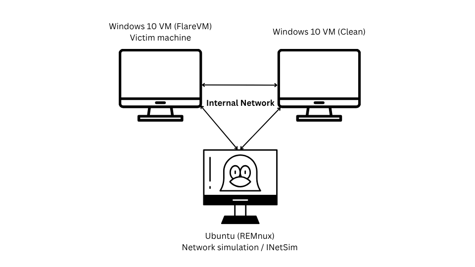
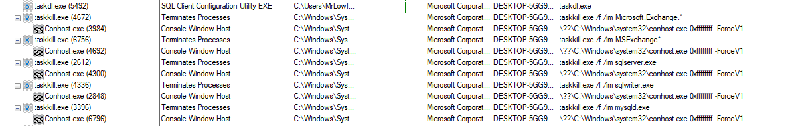

# WannaCry Ransomware Analysis Report
**Author:** Nikola Marković  
**Date:** 05.08.2025  
**Version:** 1.0

---

## 1. Executive Summary
This document presents an in-depth analysis of the WannaCry ransomware sample (`ED01EBFBC9EB5BBEA545AF4D01BF5F1071661840480439C6E5BABE8E080E41AA`), executed in a controlled lab environment.  
The objective was to collect detailed technical evidence of the malware's behavior, covering file system changes, registry modifications, process activity, network attempts, persistence mechanisms, and encryption behavior.

---

## 2. Scope & Methodology

### Purpose
- Document observable ransomware behavior from detonation to persistence.
- Capture full process creation/termination sequences.
- Map observed techniques to MITRE ATT&CK.

### Lab Environment
- **Microsoft Windows 10 Enterprise Evaluation (Version 22H2, OS Build 19045, FlareVM)** – malware detonation VM, patched, SMBv1 enabled, Windows Defender Antivirus and Windows Firewall disabled.
- **Microsoft Windows 10 Enterprise Evaluation (Version 22H2, OS Build 19045, Clean)** – clean VM connected to the same isolated network for worm propagation testing, SMBv1 enabled, Windows Defender Antivirus and Windows Firewall disabled.
- **REMnux** – network simulation / INetSim services.
- **VirtualBox Internal Network** – no internet access.

### Tools Used
**Static Analysis:** Detect It Easy, FLOSS, PEStudio, capa, Resource Hacker, 7-Zip  
**Dynamic Analysis:** Process Explorer, Process Monitor, TCPView, Wireshark, Regshot, INetSim

---

## 3. Lab Topology



*All VMs are hosted in Oracle VirtualBox, configured on the same Internal Network.*
---

## 4. OS and Patch Information
- **OS:** Microsoft Windows 10 Enterprise Evaluation
- **Build:** 22H2 (OS Build 19045.2006)
- **Architecture:** x64
- **Status:** Fully patched, SMBv1 manually enabled for test
- **Installed Updates:** KB5017022, KB5015684, KB5015020, KB5015878, KB5017308, KB5016705

---

## 5. File Metadata & Version Info

### Main Sample (hereafter referred to as main_sample.exe)
- **SHA256:** ED01EBFBC9EB5BBEA545AF4D01BF5F1071661840480439C6E5BABE8E080E41AA
- **Internal Name:** diskpart.exe
- **Compiler:** Microsoft Visual C++ 6.0
- **Size:** ~3.35 MB
- **Entropy:** ~7.99 bits/byte
- **Entry Point:** 0x000077BA (.text section)
- **Execution Context:** Invoking user account (no elevation on launch)
- **Packing & Compression:** Overall entropy ~7.99 bits/byte indicates compression/packing. The .rsrc section contains a self‑extracting ZIP archive (~36 files, ~55% encrypted).


*Detect It Easy entropy analysis showing high‑entropy .rsrc section indicating compression/packing.*


*7‑Zip inspection of .rsrc archive showing embedded helper executables, encrypted .wnry payloads, and language resources.*

### Key Dropped Components
- **`taskdl.exe`** – SHA256: 4A468603FDCB7A2EB5770705898CF9EF37AADE532A7964642ECD705A74794B79
- **`taskse.exe`** – SHA256: 2CA2D550E603D74DEDDA03156023135B38DA3630CB014E3D00B1263358C5F00D
- **`@WanaDecryptor@.exe`** – SHA256: B9C5D4339809E0AD9A00D4D3DD26FDF44A32819A54ABF846BB9B560D81391C25
- **`taskhsvc.exe`** – SHA256: E48673680746FBE027E8982F62A83C298D6FB46AD9243DE8E79B7E5A24DCD4EB (identical to tor.exe; renamed Tor client used for C2 communication)

---

## 6. Targeted File Extensions

See Appendix A for complete list.
### Categories & Examples:

1. **Cryptographic Keys & Certificates**
   - .der, .pfx, .key, .crt, .csr, .p12, .pem

2. **Office Documents & Presentations**
   - .doc, .docx, .dot, .dotm, .dotx, .docb
   - .ppt, .pptx, .pot, .potx, .potm, .ppam, .pps, .ppsx, .ppsm
   - .xls, .xlsx, .xlsm, .xlt, .xltx, .xltm, .xlm, .xlam, .xlw

3. **OpenDocument Formats**
   - .odt, .ott, .sxw, .uot, .stw
   - .ods, .ots, .sxc, .stc, .dif, .slk

4. **Database Files**
   - .accdb, .mdb, .dbf, .odb, .sql, .sqlite3, .sqlite, .frm, .myd, .myi, .ibd, .mdf, .ldf

5. **Source Code & Scripts**
   - .cpp, .pas, .asm, .cs, .java, .class, .jar
   - .bat, .cmd, .ps1, .vbs, .php, .asp, .jsp

6. **3D Models & CAD**
   - .3ds, .max, .3dm, .dwg

7. **Images & Design Files**
   - .jpg, .jpeg, .png, .bmp, .gif, .raw, .tif, .tiff
   - .psd, .svg, .nef

8. **Multimedia**
   - .mp3, .wav, .wma, .mid, .flac, .mp4, .avi, .mov, .wmv, .mkv, .3gp, .swf

9. **Archives & Backups**
   - .zip, .rar, .7z, .tar, .tgz, .bak, .tbk, .iso, .vmdk, .vdi, .backup

10. **Miscellaneous**
    - .pdf, .rtf, .txt, .csv, .hwp, .one, .snt, .msg, .eml

---

## 7. Procmon Process Tree & Command Lines

###The following Procmon process tree illustrates the execution chain observed during detonation:

High-Level Flow:
```
attrib.exe → hides targeted files with attrib +h.
icacls.exe → grants Everyone full permissions recursively.
cmd.exe → runs <randomnumber>.bat, which launches m.vbs via cscript.exe.
taskdl.exe → spawned multiple times, acts as the encryption worker.
taskse.exe → service/helper component used for payload execution control.
@WanaDecryptor@.exe → launches the ransom GUI, destructive commands, and C2 (Tor).
taskhsvc.exe (renamed tor.exe) → Tor client for C2 comms.
reg.exe → creates Run‑key persistence pointing to renamed payload.
taskkill.exe → terminates database/mail services when triggered.
vssadmin.exe / wmic.exe → delete shadow copies and disable recovery options.
```
Representative Command Lines:
```
attrib.exe           -> attrib +h
icacls.exe           -> icacls . /grant Everyone:F /T /C /Q
cmd.exe              -> cmd.exe /c 294461754036631.bat
cscript.exe          -> cscript.exe //nologo m.vbs
@WanaDecryptor@.exe  -> vssadmin delete shadows /all /quiet & wmic shadowcopy delete & bcdedit /set {default} recoveryenabled no & wbadmin delete catalog -quiet
reg.exe              -> reg add HKCU\Software\Microsoft\Windows\CurrentVersion\Run /v "wgpbmoyn685" /t REG_SZ /d "C:\Users\<User>\Desktop\tasksche.exe" /f
wmic.exe             -> wmic shadowcopy delete
```
**Note: Shadow copy deletion was not consistently observed in every run.
Behavior varied between detonations — some runs triggered taskkill.exe (service kills) but skipped shadow copy deletion, others did the reverse.
Multiple spawns of taskdl.exe and `@WanaDecryptor@.exe` were seen throughout encryption, likely one per directory or encryption batch.**




---

## 8. Registry Changes
- **Persistence Key:**
```
HKCU\Software\Microsoft\Windows\CurrentVersion\Run
  wgpbmoyn685 = "C:\Users\<User>\Desktop\tasksche.exe"
```

---

## 9. File System Changes
- Creation of `.WNCRYT` temporary encrypted files before renaming to `.WNCRY`
- Dropping ransom note shortcuts in unrelated directories
- Creation of TaskData/Tor folder

---

## 10. Processes Spawned & Terminated


| Parent Process      | Child Process / Action       | Notes                       |
|---------------------|------------------------------|-----------------------------|
| main_sample.exe     | attrib.exe (Create)          | File attribute modification |
| main_sample.exe     | icacls.exe (Create)          | Permission changes          |
| main_sample.exe     | taskdl.exe (Create)          | Encryption worker           |
 | cmd.exe            | <randomnumber>.bat (Exec)    | Batch script execution      |
| cscript.exe         | m.vbs (Exec)                 | VBScript helper             |
| main_sample.exe     | `@WanaDecryptor@.exe (Create)` | Ransomware GUI / Destructive commands / C2    |
| `@WanaDecryptor@.exe` | taskhsvc.exe (Create)        | Tor networking component    |
|  cmd.exe             | reg.exe (Create)             | Adds persistence key        |
| main_sample.exe     | taskkill.exe (Create)        | Kills DB/mail services      |
|   cmd.exe         |          WMIC.exe (create)      |   Deletes shadow copies       |

---

## 11. Scripts Executed
- `<randomnumber>.bat` – executes helper commands, launches VBS script
- `m.vbs` – runs via `cscript.exe`

---

## 12. Persistence Mechanisms
- Registry Run key pointing to renamed payload (`tasksche.exe`)

---

## 13. Network Activity
- **Local:** 127.0.0.1:9050 (Tor SOCKS proxy); taskhsvc.exe is a renamed tor.exe binary
- **Outbound Attempts:** HTTPS to C2 via Tor (reset in lab)
- **SMB Worming:** No worming observed despite SMBv1 enabled on both test VMs


*Wireshark capture showing a `.onion` address in TCP payload over loopback (127.0.0.1:9050), indicating Tor SOCKS proxy usage for C2 communication.*


*TCPView showing `taskhsvc.exe` (Tor client) and `@WanaDecryptor@.exe` maintaining established loopback connections to port 9050 (Tor SOCKS proxy).*


*Wireshark capture showing repeated TCP connection attempts and resets when WannaCry attempts outbound communication, likely due to lab network isolation blocking external C2 access.*

---

## 14. MITRE ATT&CK Mapping
| Technique ID  | Technique Name                                           | Observed Implementation in WannaCry Sample                                                                             |
| ------------- | -------------------------------------------------------- | ---------------------------------------------------------------------------------------------------------------------- |
| **T1486**     | Data Encrypted for Impact                                | `taskdl.exe` encrypts targeted files, renaming them to `.WNCRY`.                                                       |
| **T1547.001** | Boot or Logon Autostart Execution: Registry Run Key      | `reg.exe` creates `HKCU\...\Run` key for persistence (`tasksche.exe`).                                                 |
| **T1027**     | Obfuscated/Encrypted Files or Information                | Payload components (`.wnry` files, embedded executables) stored in packed/encrypted format within `.rsrc` section.     |
| **T1489**     | Service Stop                                             | `taskkill.exe` terminates database/mail services (e.g., `SQLServer`, `MySQLWriter`).                                   |
| **T1059.005** | Command and Scripting Interpreter: Visual Basic          | `m.vbs` executed via `cscript.exe` as part of helper script chain.                                                     |
| **T1059.003** | Command and Scripting Interpreter: Windows Command Shell | Batch file (`<randomnumber>.bat`) executes multiple helper commands.                                                   |
| **T1562.001** | Impair Defenses: Disable or Modify Tools                 | `vssadmin.exe` / `wmic.exe` delete shadow copies; `bcdedit.exe` disables recovery options.                             |
| **T1090.003** | Proxy: Multi-hop Proxy                                   | `taskhsvc.exe` (Tor client) establishes loopback proxy (127.0.0.1:9050) for anonymized C2 traffic.                     |
| **T1071.001** | Application Layer Protocol: Web Protocols                | Attempted outbound HTTPS C2 communication via Tor SOCKS proxy.                                                         |
| **T1105**     | Ingress Tool Transfer                                    | Pre‑bundled executables (`taskdl.exe`, `taskse.exe`, Tor client) extracted from `.rsrc` section to disk for execution. |
| **T1057**     | Process Discovery                                        | Multiple `taskdl.exe` spawns suggest iterative directory and file scanning before encryption.                          |


---

## 15. Observations & Anomalies
- Delayed execution of `taskkill.exe` (~1 hour after detonation)
- Tor client connection attempts always reset in lab
- Desktop background change blocked in FlareVM

---

## 16. Conclusion
The WannaCry sample successfully executed under the invoking user account without requiring elevation, deployed multiple helper binaries, encrypted targeted files, attempted anonymized C2 communication via Tor, and created persistence via a registry Run key.

SMB worming was not observed during testing. This absence may be due to environmental factors (e.g., lab isolation, patched hosts), sample variant limitations, or worming being dependent on successful C2 communication.

---

## 17. Appendices

### Appendix A – Full Targeted Extensions List

.der
.pfx
.key
.crt
.csr
.p12
.pem
.odt
.ott
.sxw
.stw
.uot
.3ds
.max
.3dm
.ods
.ots
.sxc
.stc
.dif
.slk
.wb2
.odp
.otp
.sxd
.std
.uop
.odg
.otg
.sxm
.mml
.lay
.lay6
.asc
.sqlite3
.sqlitedb
.sql
.accdb
.mdb
.dbf
.odb
.frm
.myd
.myi
.ibd
.mdf
.ldf
.sln
.suo
.cpp
.pas
.asm
.cmd
.bat
.ps1
.vbs
.dip
.dch
.sch
.brd
.jsp
.php
.asp
.java
.jar
.class
.mp3
.wav
.swf
.fla
.wmv
.mpg
.vob
.mpeg
.asf
.avi
.mov
.mp4
.3gp
.mkv
.3g2
.flv
.wma
.mid
.m3u
.m4u
.djvu
.svg
.psd
.nef
.tiff
.tif
.cgm
.raw
.gif
.png
.bmp
.jpg
.jpeg
.vcd
.iso
.backup
.zip
.rar
.tgz
.tar
.bak
.tbk
.bz2
.PAQ
.ARC
.aes
.gpg
.vmx
.vmdk
.vdi
.sldm
.sldx
.sti
.sxi
.602
.hwp
.snt
.onetoc2
.dwg
.pdf
.wk1
.wks
.123
.rtf
.csv
.txt
.vsdx
.vsd
.edb
.eml
.msg
.ost
.pst
.potm
.potx
.ppam
.ppsx
.ppsm
.pps
.pot
.pptm
.pptx
.ppt
.xltm
.xltx
.xlc
.xlm
.xlt
.xlw
.xlsb
.xlsm
.xlsx
.xls
.dotx
.dotm
.dot
.docm
.docb
.docx
.doc

### Appendix B – Dropped Files & Paths

#### Working Directory Structure (Observed post-infection during dynamic analysis)
```
In the working directory, WannaCry creates a "TaskData" folder with the following structure:

TaskData
│
├── Data
│   └── Tor
│       (empty in this analysis scenario – may require internet access to populate)
└── Tor
    ├── tor.exe 
    ├── taskhsvc.exe (identical to tor.exe; renamed Tor client used for C2 communication)
    ├── libeay32.dll
    ├── libevent_core-2-0-5.dll
    ├── libevent_extra-2-0-5.dll
    ├── libevent-2-0-5.dll
    ├── libgcc_s_sjij-1.dll
    ├── libssp-0.dll
    ├── ssleay32.dll
    └── zlib1.dll

Persistent Dropped Files (in the working directory)
- @WanaDecryptor@.bmp
- main_sample.exe
- taskse.exe
- taskdl.exe
- t.wnry, u.wnry, s.wnry, r.wnry, c.wnry, b.wnry, f.wnry
- msg (language pack container)
- @Please_Read_Me@.txt (also dropped in multiple other locations)
- @WanaDecryptor@.exe + shortcut (.lnk) copies in several locations
- 00000000.pky
- 00000000.eky
- 00000000.res
- TaskData folder (described above)

Other Dropped Files (likely deleted shortly after creation)
- m.vbs (created early in execution, then removed)
- 00000000.dky (appeared in working directory but not found during later inspection)

Note:
Several of these components — including msg, .wnry resource files, taskdl.exe, and taskse.exe — were pre‑bundled within the main executable’s PKZIP self‑extracting (SFX) archive located in the .rsrc section. These are extracted to disk during execution. Other files, such as Tor components and ransom note copies, are generated or written separately during runtime.
```
### Appendix C – Complete Execution Timeline, Detonation 2
```
05:47:12.3814280 : Malware detonation.
05:47:12.5687345 : taskdl.exe dropped into main_sample.exe’s directory.
05:47:12.5694580 : taskse.exe dropped into main_sample.exe’s directory.
05:47:12.5749390 : attrib.exe spawned by main_sample.exe.
05:47:12.6265974 : icacls.exe spawned by main_sample.exe.
05:47:14.0275350 : taskdl.exe process starts (repeats Load Image operation ~every 30s).
05:47:14.0998246 : taskdl.exe queries AppData\Local\Temp for *.WNCRYT (checks for prior encryption).
05:47:14.2030830 : @WanaDecryptor@.exe dropped into main_sample.exe’s directory, then replicated into multiple directories.
05:47:14.2113236 : <randomnumber>.bat dropped into main_sample.exe’s directory.
05:47:14.2267136 : Encryption of first file in first targeted directory begins.
05:47:14.2283365 : Encryption of that file completes.
05:47:14.6741577 : <randomnumber>.bat executed via cmd.exe.
05:47:15.3692540 : m.vbs created via <randomnumber>.bat.
05:47:16.3006565 : m.vbs executed via cscript.exe (launched by <randomnumber>.bat).
05:49:54.6314585 : @WanaDecryptor@.exe process spawned by main_sample.exe (recurs every ~30s).
05:49:55.9668389 : taskhsvc.exe created in TaskData\Tor, spawned by @WanaDecryptor@.exe; supporting Tor components (tor.exe, zlib1.dll, ssleay32.dll, etc.) also dropped.
05:50:14.4946558 : reg.exe spawned via cmd.exe to add persistence key:
                   HKCU\SOFTWARE\Microsoft...\Run /v "wgpbmoyn685" /t REG_SZ /d "C:\Users...\tasksche.exe" /f
06:34:35.5880277 : taskkill.exe spawned by main_sample.exe.
```


### Appendix D – Hashes and Metadata

- taskdl.exe and taskse.exe initially have no embedded version metadata and no human-readable strings.
- After execution, these helpers are rewritten to disk with forged Microsoft metadata matching the primary payload’s style
- This suggests dynamic resource injection — the malware modifies or adds version information at runtime before persisting the files to disk.
```
1. Main Sample

File Name: ed01ebfbc9eb5bbea545af4d01bf5f1071661840480439c6e5babe8e080e41aa.exe
File Path: C:\Users\MrLowIQ\Desktop\ed01ebfbc9eb5bbea545af4d01bf5f1071661840480439c6e5babe8e080e41aa.exe
File Type: Portable Executable 32
File Info: Microsoft Visual C++ 6.0
File Size: 3.35 MB (3514368 bytes)
PE Size: 3.35 MB (3514368 bytes)
Created: Sunday 03 August 2025, 09:36:10
Modified: Wednesday 30 July 2025, 11:37:14
Accessed: Sunday 03 August 2025, 09:38:25
SHA256: ed01ebfbc9eb5bbea545af4d01bf5f1071661840480439c6e5babe8e080e41aa
MD5: 84C82835A5D21BBCF75A61706D8AB549
SHA-1: 5FF465AFAABCBF0150D1A3ABC2E74F3A4426467

Version Info:
- CompanyName: Microsoft Corporation
- FileDescription: DiskPart
- FileVersion: 6.1.7601.17514 (win7sp1_rtm.101119-1850)
- InternalName: diskpart.exe
- LegalCopyright: © Microsoft Corporation. All rights reserved.
- OriginalFilename: diskpart.exe
- ProductName: Microsoft® Windows® Operating System


2. @WanaDecryptor@.exe

File Name: @WanaDecryptor@.exe
File Path: C:\Users\MrLowIQ\Desktop\@WanaDecryptor@.exe
File Type: Portable Executable 32
File Info: Microsoft Visual C++ 6.0
File Size: 240.00 KB (245760 bytes)
PE Size: 240.00 KB (245760 bytes)
Created: Sunday 03 August 2025, 09:47:00
Modified: Friday 12 May 2017, 02:22:56
Accessed: Sunday 03 August 2025, 09:47:45
SHA256: B9C5D4339809E0AD9A00D4D3DD26FDF44A32819A54ABF846BB9B560D81391C25  
MD5: 7FB2B57F2A205768755C07F23FBF32CC
SHA-1: 453563A9DD616ED7161A3B9192EF31B0DA85AD10

Version Info:
- CompanyName: Microsoft Corporation
- FileDescription: Load PerfMon Counters
- FileVersion: 6.1.7600.16385 (win7_rtm.090713-1255)
- InternalName: LODCTR.EXE
- LegalCopyright: © Microsoft Corporation. All rights reserved.
- OriginalFilename: LODCTR.EXE
- ProductName: Microsoft® Windows® Operating System


3. taskse.exe

Initially contains no version metadata; metadata added at runtime by main_sample.exe before persistence.
File Name: taskse.exe
File Path: C:\Users\MrLowIQ\Desktop\taskse.exe
File Type: Portable Executable 32
File Info: Microsoft Visual C++ 6.0
File Size: 20.00 KB (20480 bytes)
PE Size: 20.00 KB (20480 bytes)
Created: Friday 12 May 2017, 02:22:56
Modified: Friday 12 May 2017, 02:22:56
Accessed: Sunday 03 August 2025, 09:48:30
SHA256: 2CA2D550E603D74DEDDA03156023135B38DA3630CB014E3D00B1263358C5F00D 
MD5: 8495400F199AC77853C53B5A3F27F83E
SHA-1: BE5D6279874DA315E3080B6083757AAD9B32C23

Version Info:
- CompanyName: Microsoft Corporation
- FileDescription: waitfor - wait/send a signal over a network
- FileVersion: 6.1.7600.16385 (win7_rtm.090713-1255)
- InternalName: waitfor.exe
- LegalCopyright: © Microsoft Corporation. All rights reserved.
- OriginalFilename: waitfor.exe
- ProductName: Microsoft® Windows® Operating System


4. taskdl.exe

Initially contains no version metadata; metadata added at runtime by main_sample.exe before persistence.
File Name: taskdl.exe
File Path: C:\Users\MrLowIQ\Desktop\taskdl.exe
File Type: Portable Executable 32
File Info: Microsoft Visual C++ 6.0
File Size: 20.00 KB (20480 bytes)
PE Size: 20.00 KB (20480 bytes)
Created: Friday 12 May 2017, 02:22:56
Modified: Friday 12 May 2017, 02:22:56
Accessed: Sunday 03 August 2025, 09:48:30
SHA256: 4A468603FDCB7A2EB5770705898CF9EF37AADE532A7964642ECD705A74794B79
MD5: 4FFE5E3413E646DBF9907C4374276F5
SHA-1: 47A9AD4125B68D7C55E4E7DA251E23F089407B8F

Version Info:
- CompanyName: Microsoft Corporation
- FileDescription: SQL Client Configuration Utility EXE
- FileVersion: 6.1.7600.16385 (win7_rtm.090713-1255)
- InternalName: cliconfg.exe
- LegalCopyright: © Microsoft Corporation. All rights reserved.
- OriginalFilename: cliconfg.exe
- ProductName: Microsoft® Windows® Operating System


5. taskhsvc.exe

No metadata
SHA256: E48673680746FBE027E8982F62A83C298D6FB46AD9243DE8E79B7E5A24DCD4EB       
```
### Appendix E – Strings of Interest

main_sample.exe
```
inflate 1.1.3 Copyright 1995-1998 Mark Adler
unzip 0.15 Copyright 1998 Gilles Vollant
.WNCRY
.WNCRYT
t.wnry
b.wnry
icacls . /grant Everyone:F /T /C /Q
attrib +h .
WNcry@2o17
taskse.exe
TaskStart
Taskschd.exe
cmd.exe /c "%s"
Microsoft Enhanced RSA and AES Cryptographic Provider
CryptGenKey
CryptDecrypt
CryptEncrypt
CryptDestroyKey
CryptImportKey
Global\MsWinZonesCacheCounterMutexA
Tasksch.exe
buffer error
stream error
file error
vssadmin delete shadows /all /quiet
wmic shadowcopy delete
..\..
%WINDIR%
%SystemRoot%
```


`@WanaDecryptor@.exe`
```
"Congratulations! Your payment has been checked!"
"Start decrypting now!"
"Failed to check your payment!"
"Pay now if you didn't and check again after 2 hours."
"Please select a host to decrypt."
"All your files have been decrypted!"
.wnry
.WNCRY
.WNCRYT
00000000.pky
00000000.eky
00000000.res
00000000.dky
vssadmin delete shadows /all /quiet
wmic shadowcopy delete
tor.exe
taskhsvc.exe
127.0.0.1
"Microsoft Enhanced RSA and AES Cryptographic Provider"
English
Rising
Tencent
360Safe
Mozilla
Adobe
Yahoo
Google
```

taskse.exe
```
waitfor.exe
winsta0\default
SeTcbPrivilege
WTSQueryUserToken
DestroyEnvironmentBlock
CreateEnvironmentBlock
CreateProcessAsUserA
DuplicateTokenEx
AdjustTokenPrivileges
LookupPrivilegeValueA
OpenProcessToken
WTSEnumerateSessionsA
Microsoft Corporation
ProductName: Microsoft Windows
ProductVersion: 6.1.7600.16385 (win7_rtm.090713-1255)
InternalName: waitfor.exe
OriginalFilename: waitfor.exe
```

taskdl.exe
```
%Recycle
%SystemDrive%
%SystemRoot%
C:\%s
%s\%s
%s_*%s
.WNCRYT
SQL Client Configuration Utility EXE
cliconfg.exe
Microsoft Corporation
InternalName: cliconfg.exe
OriginalFilename: cliconfg.exe
ProductVersion: 6.1.7600.16385 (win7_rtm.090713-1255)
FindFirstFileW
FindNextFileW
GetLogicalDrives
DeleteFileW
Sleep
GetDriveTypeW
```

---

## 19. Advanced Analysis Placeholders (Not Performed)
These are standard in a full forensic report but were not performed in this analysis:
- Memory dump & RAM scanning (Volatility, Rekall)
- DLL injection mapping
- Shell hijacking checks
- Code injection tracing
- In-depth reverse engineering (IDA, Ghidra)
